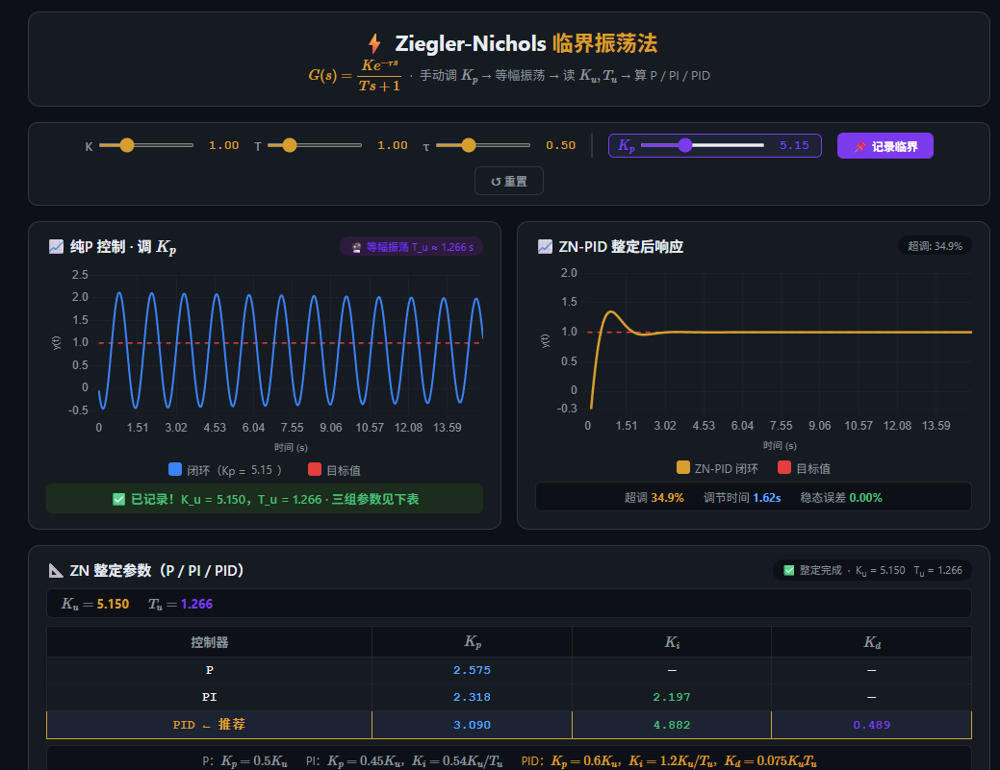
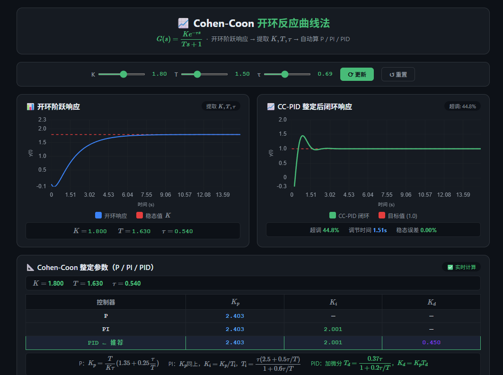

# PID控制原理与整定

> **核心思想**：改变系统，本质就是改变系统的传递函数 $G(s)$。设计控制器，就是利用控制器的频域特性（引入零极点）改造原系统开环特性，根据性能要求和硬件约束，设计出符合预期的闭环系统函数。

---

## 一、方法论：目标导向的频域整定法

PID的本质是一个**可任意配置零极点的均衡器**。设计流程如下：

### 第1步：设计目标闭环传递函数 $T_{des}(s)$

根据性能要求，直接写出你期望的闭环传递函数形态：

| 性能要求 | 典型 $T_{des}(s)$ | 关键参数 |
|:---|:---|:---|
| 无超调，响应快 | 一阶：$\dfrac{\omega_b}{s+\omega_b}$ | $\omega_b$ 决定响应速度 |
| 允许 $\sigma\%$ 超调 | 二阶：$\dfrac{\omega_n^2}{s^2+2\zeta\omega_n s+\omega_n^2}$ | $\zeta$ 决定超调，$\omega_n$ 决定速度 |
| 快速且小超调 | ITAE最优型（2~3阶） | 查表系数 |

**超调量与阻尼比关系**：

$$\zeta=\sqrt{\frac{(\ln\sigma)^2}{\pi^2+(\ln\sigma)^2}}$$

> 例：允许 5% 超调 → $\zeta \approx 0.69$

### 第2步：反推所需开环传递函数 $L_{des}(s)$

由闭环关系 $T(s)=L/(1+L)$：

$$L_{des}(s)=\frac{T_{des}(s)}{1-T_{des}(s)}$$

### 第3步：计算并实现控制器 $G_c(s)$

$$G_c(s)=\frac{L_{des}(s)}{G(s)}$$

- 若 $G_c(s)$ 恰为 **PI/PID 形式** → 直接实现
- 若 $G_c(s)$ 更复杂 → 用 PID **近似匹配**（主导极点匹配/高频低频匹配）
- 若分子分母阶次不匹配（$1-T_{des}$ 在 $s=0$ 处有常数项）→ 需引入**前置滤波器** $F(s)$ 或采用**二自由度控制**（前馈+反馈分离）

**PID最多拥有俩个零点,面对多阶系统，非主导极点推到高频区即可,更多影响带宽的是主导极点**

---

## 二、PID控制律与频域特性

### 2.1 控制律

$$u(t)=K_p e(t)+K_i\int_0^t e(\tau)d\tau+K_d\frac{de(t)}{dt}$$

$$G_c(s)=K_p+\frac{K_i}{s}+K_d s=\frac{K_d s^2+K_p s+K_i}{s}$$

### 2.2 频域特性

$$G_c(j\omega)=K_p+j\left(K_d\omega-\frac{K_i}{\omega}\right)$$

| 环节 | 幅值 | 相位 | 作用频段 | 核心作用 |
|:---:|:---:|:---:|:---:|:---|
| P | $K_p$ | $0°$ | 全频段 | 决定响应速度 |
| I | $K_i/\omega$ | $-90°$ | 低频段 | 消除静差（强制积分） |
| D | $K_d\omega$ | $+90°$ | 高频段 | 提升相角裕度（补偿积分滞后） |

---

## 三、PID对典型被控对象的匹配实现

### 3.1 一阶系统 → 目标一阶（无超调）

**被控对象**：$G(s)=\dfrac{1}{Ts+1}$

**控制器**：PI（$K_d=0$）

**零极点对消**：令控制器零点抵消对象极点

$$\frac{K_i}{K_p}=\frac{1}{T} \quad\Longrightarrow\quad K_p=K_iT$$

**改造后开环**：$L(s)= G(s) * Gpi(s) = \dfrac{K_i}{s}$

**闭环**：$T(s)=\dfrac{K_i}{s+K_i}$

**设计公式**：

$$\boxed{K_i=\omega_b,\quad K_p=\omega_b T}$$

---

### 3.2 二阶系统 → 目标一阶（无超调）

**被控对象**：$G(s)=\dfrac{\omega_n^2}{s^2+2\zeta\omega_n s+\omega_n^2}=\dfrac{\omega_n^2}{(s+p_1)(s+p_2)}$

**控制器**：PID

**双零点对消**：$G_{PID}(s)=\dfrac{K_d(s+p_1)(s+p_2)}{s}$

$$K_p=K_d\cdot 2\zeta\omega_n,\quad K_i=K_d\omega_n^2$$

**改造后开环**：$L(s)=\dfrac{K_d\omega_n^2}{s}$

**闭环**：$T(s)=\dfrac{K_d\omega_n^2}{s+K_d\omega_n^2}$

**设计公式**：

$$\boxed{K_d=\frac{\omega_b}{\omega_n^2},\quad K_p=\frac{2\zeta\omega_b}{\omega_n},\quad K_i=\omega_b}$$

---

### 3.3 二阶系统 → 目标二阶（允许超调）

**被控对象**：$G(s)=\dfrac{\omega_{n0}^2}{s^2+2\zeta_0\omega_{n0}s+\omega_{n0}^2}$

**目标闭环**：$T_{des}(s)=\dfrac{\omega_n^2}{s^2+2\zeta\omega_n s+\omega_n^2}$

> $\zeta$ 由允许超调量决定，$\omega_n$ 由响应速度要求决定

**反推开环**：

$$L_{des}(s)=\frac{T_{des}}{1-T_{des}}=\frac{\omega_n^2}{s^2+2\zeta\omega_n s}$$

**所需控制器**：

$$G_c(s)=\frac{L_{des}(s)}{G(s)}=\frac{\omega_n^2}{s^2+2\zeta\omega_n s}\cdot\frac{s^2+2\zeta_0\omega_{n0}s+\omega_{n0}^2}{\omega_{n0}^2}$$

**实现策略**：此 $G_c(s)$ 通常不是标准PID。工程中采用：

- **近似匹配**：用PID的2个零点去匹配被控对象的一对共轭极点，保留目标阻尼 $\zeta$
- **PID + 前置滤波器**：先用PID抵消被控对象极点使其变成一阶，再用前置滤波器塑造目标二阶响应

---

## 四、实际系统的约束

### 4.1 带宽 $\omega_b$ 的选择约束

- **执行器饱和**：$\omega_b$ 受限于执行器最大输出速率
- **传感器噪声**：高频噪声限制 $K_d$ 取值
- **采样频率**：$\omega_b < 0.1\omega_s$（采样频率的十分之一）

### 4.2 实际微分环节

理想微分 $K_d s$ 会放大高频噪声，工程中改用**一阶高通滤波**：

$$G_{D\_real}(s)=\frac{K_d s}{1+T_d s/N},\quad N\in[10,20]$$

### 4.3 积分饱和（Anti-windup）

当执行器饱和时，积分项会持续累积。常用对策：
- 积分分离：误差大时暂停积分
- 积分限幅：限制积分项输出范围
- 遇限削弱：饱和时反向计算积分值

---

## 五、经典整定方法详解

以下所有示例使用统一被控对象：

**一阶带滞后系统**：

$$G_1(s)=\frac{1}{s+1}e^{-0.5s}$$

**二阶系统**：

$$G_2(s)=\frac{1}{s^2+1.2s+1}$$

### 5.1 Ziegler-Nichols 整定法

> 适用：一阶/二阶系统（含纯滞后），工程中最常用的经验整定法

**步骤**：

1. 仅用 P 控制器（$K_i=0,\ K_d=0$），逐渐增大 $K_p$ 直到系统等幅振荡
2. 记录此时的**临界增益** $K_u$ 和**临界振荡周期** $T_u$
3. 按经验公式计算PID参数：

| 控制器类型 | $K_p$ | $K_i$ | $K_d$ |
|:---:|:---:|:---:|:---:| 
| P | $0.5K_u$ | — | — |
| PI | $0.45K_u$ | $0.54K_u/T_u$ | — |
| PID | $0.6K_u$ | $1.2K_u/T_u$ | $0.075K_u T_u$ 

一阶滞后模型的交互界面[Z-N演示](./zn.html)

---

### 5.2 Cohen-Coon 整定法

> 适用：一阶系统 + 纯滞后，即 $G(s)=\dfrac{K e^{-\tau s}}{Ts+1}$

**步骤**：

1. 对被控对象施加阶跃信号，记录开环阶跃响应曲线
2. 提取三个特征参数：
   - 静态增益 $K$
   - 时间常数 $T$
   - 纯滞后时间 $\tau$

$$K_p=\frac{T}{K\tau}\left(1.35+\frac{0.25\tau}{T}\right)$$

$$K_i=\frac{K_p}{T_i},\quad T_i=\frac{\tau\left(2.5+\frac{0.5\tau}{T}\right)}{1+\frac{0.6\tau}{T}}$$

$$K_d=K_p T_d,\quad T_d=\frac{0.37\tau}{1+\frac{0.2\tau}{T}}$$
一阶滞后模型的交互界面[Cohen-Coon演示](./cohen-coon.html)

---

### 5.3 内模控制（IMC）整定法

> 适用：大多数系统，鲁棒性最好的整定方法之一

**核心思想**：

1. 将被控对象分解为**可逆部分** $G_-(s)$ 和**不可逆部分** $G_+(s)$（含纯滞后和右半平面零点）：

$$G(s)=G_-(s)\cdot G_+(s)$$

2. 控制器设计为：
   $$G_{IMC}(s)=G_-(s)^{-1}\cdot f(s)$$
   其中 $f(s)$ 为低通滤波器，$\displaystyle f(s)=\frac{1}{(\lambda s+1)^n}$

3. 最终反馈控制器：
   $$G_c(s)=\frac{G_{IMC}(s)}{1-G(s)G_{IMC}(s)}$$

**一阶系统 IMC 整定公式**（$G(s)=\dfrac{K}{Ts+1}$）：

$$K_p=\frac{T}{K(\lambda+\tau)},\quad T_i=T,\quad T_d=0$$

其中 $\lambda$ 为**滤波器时间常数**（唯一设计参数），$\lambda$ 越小响应越快，但鲁棒性下降。

**特点**：参数整定直观，鲁棒性与性能的折中清晰可控。

---

### 5.4 ITAE 最优整定法

> 适用：大多数系统，追求最优响应性能

**核心思想**：配置闭环极点使积分时间绝对误差指标最小化：

$$J_{ITAE}=\int_0^\infty t|e(t)|dt$$

**ITAE 最优闭环极点配置**（标准型，无超调/小超调）：

| 系统阶次 | 分母多项式（以 $\omega_n$ 归一化） |
|:---:|:---|
| 2阶 | $s^2+1.4\omega_n s+\omega_n^2$ |
| 3阶 | $s^3+1.75\omega_n s^2+2.15\omega_n^2 s+\omega_n^3$ |

**设计方法**：

1. 确定被控对象模型
2. 选择期望 ITAE 标准型 $T_{des}(s)$
3. 反推 $L_{des}(s)=T_{des}/(1-T_{des})$
4. 计算 $G_c(s)=L_{des}(s)/G(s)$
5. 用 PID 匹配 $G_c(s)$（主导极点近似）

**特点**：响应速度快、超调小，是性能最优的整定方法。

---

### 5.5 频域设计法

> 适用：大多数系统，从稳定性和带宽角度设计

**步骤**：

1. 绘制被控对象 $G(s)$ 的 Bode 图
2. 确定当前幅值裕度 $G_m$ 和相角裕度 $P_m$
3. 根据设计要求设定目标裕度：
   - 相角裕度 $P_m \in [30°, 60°]$
   - 幅值裕度 $G_m \geq 6\text{dB}$
4. 通过 PID 的频域特性调整开环 Bode 图：
   - P：整体平移幅值曲线，改变截止频率 $\omega_c$
   - I：低频段斜率从 0dB/dec → -20dB/dec（消除静差）
   - D：高频段增加 +90° 相位（提升相角裕度）

**设计公式**（相位裕度法）：

$$K_p = \frac{1}{|G(j\omega_c)|}$$

$$K_i \approx \frac{\omega_c}{10}\quad(\text{低频积分转折频率远低于}\omega_c)$$

$$K_d \approx \frac{\omega_c}{10}\cdot\frac{1}{\omega_c^2} = \frac{1}{10\omega_c}\quad(\text{高频微分转折频率远高于}\omega_c)$$

**特点**：物理意义清晰，直观体现稳定性（裕度）与响应速度（带宽）的折中。
