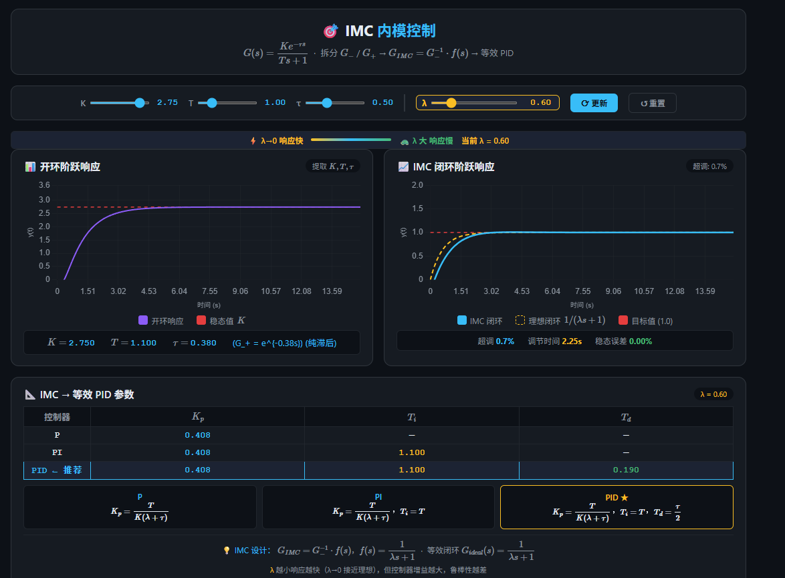
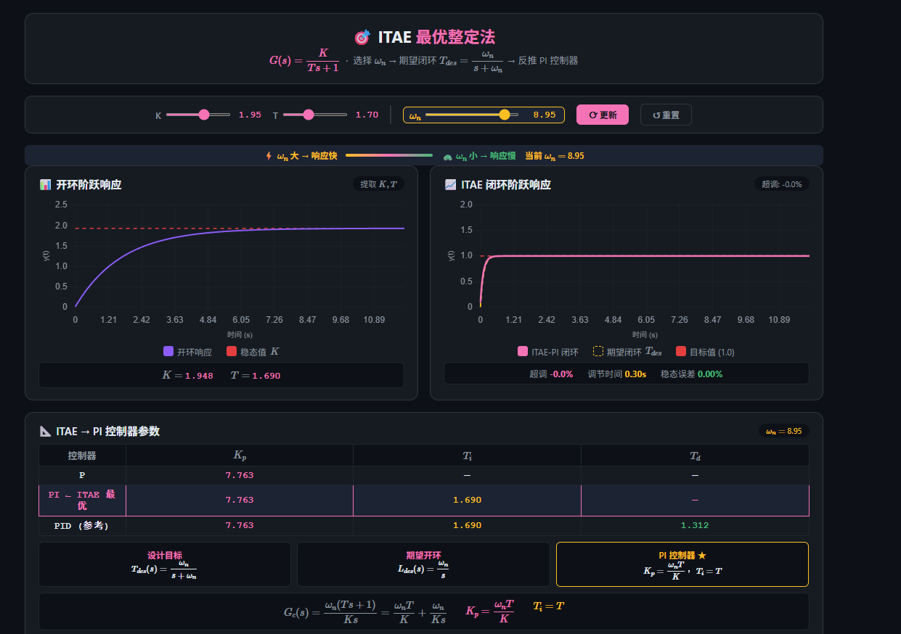
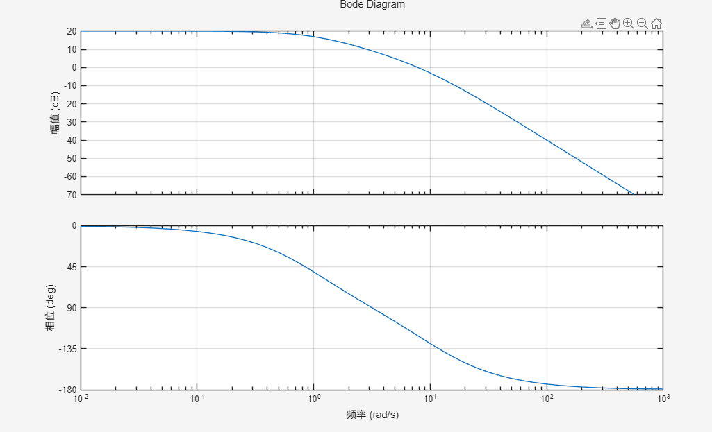
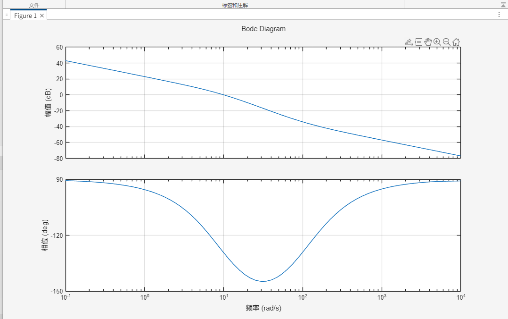

# PID控制原理与整定

> **核心思想**：改变系统，本质就是改变系统的传递函数 $G(s)$。设计控制器，就是利用控制器的频域特性（引入零极点）改造原系统开环特性，根据性能要求和硬件约束，设计出符合预期的闭环系统函数。

---

## 一、方法论：目标导向的频域整定法

PID的本质是一个**可任意配置零极点的均衡器**。设计流程如下：

### 第1步：设计目标闭环传递函数 $T_{des}(s)$

根据性能要求，直接写出你期望的闭环传递函数形态：

| 性能要求 | 典型 $T_{des}(s)$ | 关键参数 |
|:---|:---|:---|
| 无超调，响应快 | 一阶：$\dfrac{\omega_b}{s+\omega_b}$ | $\omega_b$ 决定响应速度 |
| 允许 $\sigma\%$ 超调 | 二阶：$\dfrac{\omega_n^2}{s^2+2\zeta\omega_n s+\omega_n^2}$ | $\zeta$ 决定超调，$\omega_n$ 决定速度 |
| 快速且小超调 | ITAE最优型（2~3阶） | 查表系数 |

**超调量与阻尼比关系**：

$$\zeta=\sqrt{\frac{(\ln\sigma)^2}{\pi^2+(\ln\sigma)^2}}$$

> 例：允许 5% 超调 → $\zeta \approx 0.69$

### 第2步：反推所需开环传递函数 $L_{des}(s)$

由闭环关系 $T(s)=L/(1+L)$：

$$L_{des}(s)=\frac{T_{des}(s)}{1-T_{des}(s)}$$

### 第3步：计算并实现控制器 $G_c(s)$

$$G_c(s)=\frac{L_{des}(s)}{G(s)}$$

- 若 $G_c(s)$ 恰为 **PI/PID 形式** → 直接实现
- 若 $G_c(s)$ 更复杂 → 用 PID **近似匹配**（主导极点匹配/高频低频匹配）
- 若分子分母阶次不匹配（$1-T_{des}$ 在 $s=0$ 处有常数项）→ 需引入**前置滤波器** $F(s)$ 或采用**二自由度控制**（前馈+反馈分离）


**PID最多拥有俩个零点,面对多阶系统，非主导极点推到高频区即可,更多影响带宽的是主导极点**

---

## 二、PID控制律与频域特性

### 2.1 控制律

$$u(t)=K_p e(t)+K_i\int_0^t e(\tau)d\tau+K_d\frac{de(t)}{dt}$$

$$G_c(s)=K_p+\frac{K_i}{s}+K_d s=\frac{K_d s^2+K_p s+K_i}{s}$$

### 2.2 频域特性

$$G_c(j\omega)=K_p+j\left(K_d\omega-\frac{K_i}{\omega}\right)$$

| 环节 | 幅值 | 相位 | 作用频段 | 核心作用 |
|:---:|:---:|:---:|:---:|:---|
| P | $K_p$ | $0°$ | 全频段 | 决定响应速度 |
| I | $K_i/\omega$ | $-90°$ | 低频段 | 消除静差（强制积分） |
| D | $K_d\omega$ | $+90°$ | 高频段 | 提升相角裕度（补偿积分滞后） |

---

## 三、PID对典型被控对象的匹配实现

### 3.1 一阶系统 → 目标一阶（无超调）

**被控对象**：$G(s)=\dfrac{1}{Ts+1}$

**控制器**：PI（$K_d=0$）

**零极点对消**：令控制器零点抵消对象极点

$$\frac{K_i}{K_p}=\frac{1}{T} \quad\Longrightarrow\quad K_p=K_iT$$

**改造后开环**：$L(s)= G(s) * Gpi(s) = \dfrac{K_i}{s}$

**闭环**：$T(s)=\dfrac{K_i}{s+K_i}$

**设计公式**：

$$\boxed{K_i=\omega_b,\quad K_p=\omega_b T}$$

---

### 3.2 二阶系统 → 目标一阶（无超调）

**被控对象**：$G(s)=\dfrac{\omega_n^2}{s^2+2\zeta\omega_n s+\omega_n^2}=\dfrac{\omega_n^2}{(s+p_1)(s+p_2)}$

**控制器**：PID

**双零点对消**：$G_{PID}(s)=\dfrac{K_d(s+p_1)(s+p_2)}{s}$

$$K_p=K_d\cdot 2\zeta\omega_n,\quad K_i=K_d\omega_n^2$$

**改造后开环**：$L(s)=\dfrac{K_d\omega_n^2}{s}$

**闭环**：$T(s)=\dfrac{K_d\omega_n^2}{s+K_d\omega_n^2}$

**设计公式**：

$$\boxed{K_d=\frac{\omega_b}{\omega_n^2},\quad K_p=\frac{2\zeta\omega_b}{\omega_n},\quad K_i=\omega_b}$$

---

### 3.3 二阶系统 → 目标二阶（允许超调）

**被控对象**：$G(s)=\dfrac{\omega_{n0}^2}{s^2+2\zeta_0\omega_{n0}s+\omega_{n0}^2}$

**目标闭环**：$T_{des}(s)=\dfrac{\omega_n^2}{s^2+2\zeta\omega_n s+\omega_n^2}$

> $\zeta$ 由允许超调量决定，$\omega_n$ 由响应速度要求决定

**反推开环**：

$$L_{des}(s)=\frac{T_{des}}{1-T_{des}}=\frac{\omega_n^2}{s^2+2\zeta\omega_n s}$$

**所需控制器**：

$$G_c(s)=\frac{L_{des}(s)}{G(s)}=\frac{\omega_n^2}{s^2+2\zeta\omega_n s}\cdot\frac{s^2+2\zeta_0\omega_{n0}s+\omega_{n0}^2}{\omega_{n0}^2}$$

**实现策略**：此 $G_c(s)$ 通常不是标准PID。工程中采用：

- **近似匹配**：用PID的2个零点去匹配被控对象的一对共轭极点，保留目标阻尼 $\zeta$
- **PID + 前置滤波器**：先用PID抵消被控对象极点使其变成一阶，再用前置滤波器塑造目标二阶响应

---

## 四、实际系统的约束

### 4.1 带宽 $\omega_b$ 的选择约束

- **执行器饱和**：$\omega_b$ 受限于执行器最大输出速率
- **传感器噪声**：高频噪声限制 $K_d$ 取值
- **采样频率**：$\omega_b < 0.1\omega_s$（采样频率的十分之一）

### 4.2 实际微分环节

理想微分 $K_d s$ 会放大高频噪声，工程中改用**一阶高通滤波**：

$$G_{D\_real}(s)=\frac{K_d s}{1+T_d s/N},\quad N\in[10,20]$$

### 4.3 积分饱和（Anti-windup）

当执行器饱和时，积分项会持续累积。常用对策：
- 积分分离：误差大时暂停积分
- 积分限幅：限制积分项输出范围
- 遇限削弱：饱和时反向计算积分值

---

## 五、经典整定方法详解

以下所有示例使用统一被控对象：

**一阶带滞后系统**：

$$G_1(s)=\frac{1}{s+1}e^{-0.5s}$$

**二阶系统**：

$$G_2(s)=\frac{1}{s^2+1.2s+1}$$

### 5.1 Ziegler-Nichols 整定法

> 适用：一阶/二阶系统（含纯滞后），工程中最常用的经验整定法

**步骤**：

1. 仅用 P 控制器（$K_i=0,\ K_d=0$），逐渐增大 $K_p$ 直到系统等幅振荡
2. 记录此时的**临界增益** $K_u$ 和**临界振荡周期** $T_u$
3. 按经验公式计算PID参数：

| 控制器类型 | $K_p$ | $K_i$ | $K_d$ |
|:---:|:---:|:---:|:---:| 
| P | $0.5K_u$ | — | — |
| PI | $0.45K_u$ | $0.54K_u/T_u$ | — |
| PID | $0.6K_u$ | $1.2K_u/T_u$ | $0.075K_u T_u$ 

一阶滞后模型的交互界面[Z-N演示](./zn.html)


---

### 5.2 Cohen-Coon 整定法

> 适用：一阶系统 + 纯滞后，即 $G(s)=\dfrac{K e^{-\tau s}}{Ts+1}$

**步骤**：

1. 对被控对象施加阶跃信号，记录开环阶跃响应曲线
2. 提取三个特征参数：
   - 静态增益 $K$
   - 时间常数 $T$
   - 纯滞后时间 $\tau$

$$K_p=\frac{T}{K\tau}\left(1.35+\frac{0.25\tau}{T}\right)$$

$$K_i=\frac{K_p}{T_i},\quad T_i=\frac{\tau\left(2.5+\frac{0.5\tau}{T}\right)}{1+\frac{0.6\tau}{T}}$$

$$K_d=K_p T_d,\quad T_d=\frac{0.37\tau}{1+\frac{0.2\tau}{T}}$$
一阶滞后模型的交互界面[Cohen-Coon演示](./cohen-coon.html)


---

### 5.3 内模控制（IMC）整定法

> 适用：大多数系统，鲁棒性最好的整定方法之一

**核心思想**：

1. 将被控对象分解为**可逆部分** $G_-(s)$ 和**不可逆部分** $G_+(s)$（含纯滞后和右半平面零点）：(其实就是分母阶数 > 分子,则该部分可逆，滞后系统 $exp(-t)$ 不可逆)

$$G(s)=G_-(s)\cdot G_+(s)$$

2. 控制器设计为：
   $$G_{IMC}(s)=G_-(s)^{-1}\cdot f(s)$$
   其中 $f(s)$ 为低通滤波器，$\displaystyle f(s)=\frac{1}{(\lambda s+1)^n}$

3. 最终反馈控制器：
   $$G_c(s)=\frac{G_{IMC}(s)}{1-G(s)G_{IMC}(s)}$$

举例：**一阶系统 IMC 整定公式**（$G(s)=\dfrac{K}{Ts+1}$）：

$$K_p=\frac{T}{K(\lambda+\tau)},\quad T_i=T,\quad T_d=0$$

其中 $\lambda$ 为**滤波器时间常数**（唯一设计参数），$\lambda$ 越小响应越快，但鲁棒性下降。

**特点**：参数整定直观，鲁棒性与性能的折中清晰可控。

一阶滞后模型的交互界面[imc演示](./imc.html)


---

### 5.4 ITAE 最优整定法

> 适用：大多数系统，追求最优响应性能

**核心思想**：配置闭环极点使积分时间绝对误差指标最小化：

$$J_{ITAE}=\int_0^\infty t|e(t)|dt$$
- ITAE 给后期误差更大的惩罚，迫使系统快速消除误差

**ITAE 最优闭环极点配置**（标准型，无超调/小超调）：

系统阶次 | 分母多项式 D(s) | 对应超调量
---------|-----------------|-----------
1阶      | s + ω_n         | 0%
2阶      | s² + 1.4ω_n·s + ω_n² | ≈ 4.6%
3阶      | s³ + 1.75ω_n·s² + 2.15ω_n²·s + ω_n³ | ≈ 2%

**设计方法**：

#### 5.4.3 设计步骤

已知条件：被控对象传递函数 \( G(s) \)

**Step 1：确定期望闭环传递函数 \( T_{des}(s) \)**

根据系统阶次选择对应的 ITAE 最优分母，并确定 \( \omega_n \)：

$$
T_{des}(s)=\frac{\omega_n^n}{D(s)}
$$

其中 \( D(s) \) 为上表对应的标准化分母多项式。

**Step 2：计算期望开环传递函数 \( L_{des}(s) \)**

$$
L_{des}(s)=\frac{T_{des}(s)}{1-T_{des}(s)}
$$

**Step 3：计算所需控制器 \( G_c(s) \)**

$$
G_c(s)=\frac{L_{des}(s)}{G(s)}
$$

**Step 4：PID 参数匹配**

$$
G_c(s)=K_p\left(1+\frac{1}{T_i s}+T_d s\right)
$$

将 Step 3 得到的 \( G_c(s) \) 展开，比较系数即可得到 \( K_p \)、\( T_i \)、\( T_d \)。

> 若对象阶次较高，可用**主导极点近似**（忽略离虚轴较远的极点）降阶后再匹配。


#### 5.4.4 设计示例一：一阶系统 + PI 控制器

**被控对象：**

$$
G(s)=\frac{K}{Ts+1}
$$

**Step 1：选择 ITAE 一阶标准型**

一阶系统对应的期望闭环传递函数为：

$$
T_{des}(s)=\frac{\omega_n}{s+\omega_n}
$$

**Step 2：反推开环传递函数**

$$
L_{des}(s)=\frac{T_{des}(s)}{1-T_{des}(s)}
=\frac{\dfrac{\omega_n}{s+\omega_n}}{1-\dfrac{\omega_n}{s+\omega_n}}
=\frac{\omega_n}{s}
$$

**Step 3：计算控制器传递函数**

$$
G_c(s)=\frac{L_{des}(s)}{G(s)}
=\frac{\dfrac{\omega_n}{s}}{\dfrac{K}{Ts+1}}
=\frac{\omega_n(Ts+1)}{Ks}
=\frac{\omega_n T}{K}+\frac{\omega_n}{Ks}
$$

**Step 4：匹配 PI 控制器参数**

标准 PI 控制器形式：

$$
G_c(s)=K_p\left(1+\frac{1}{T_i s}\right)=K_p+\frac{K_p}{T_i s}
$$

对比系数：

$$
K_p+\frac{K_p}{T_i s}=\frac{\omega_n T}{K}+\frac{\omega_n}{Ks}
$$

得到：

$$
K_p=\frac{\omega_n T}{K},\qquad T_i=T,\qquad T_d=0
$$

**设计参数选取：**

唯一的设计参数是 \( \omega_n \)，它决定了闭环系统的响应速度。

- \( \omega_n \) 越大 → 响应越快，但执行器输出越大
- \( \omega_n \) 越小 → 响应越慢，但控制量更平缓

> **工程经验：** \( \omega_n \) 通常取值为对象带宽的 2~5 倍，同时需保证执行器不饱和。


一阶模型的交互界面[ITAE演示](./itae.html)




---


### 5.5 频域设计法

> 适用：大多数系统，从稳定性和带宽角度设计


#### 5.5.1 核心思想

频域设计法的核心思想是：**通过调整 PID 参数，将开环系统的 Bode 图塑造成期望的形状，使系统满足给定的稳定裕度和带宽要求**。

Bode 图直观反映了系统的三大特性：

| 频段 | 对应特性 | 设计目标 |
|:---|:---|:---|
| 低频段（$\omega \ll \omega_c$） | 稳态精度 | 斜率越陡（-20dB/dec），型别越高，静差越小 |
| 中频段（$\omega \approx \omega_c$） | 稳定性、响应速度 | 穿越斜率 -20dB/dec，保证足够的相角裕度 |
| 高频段（$\omega \gg \omega_c$） | 抗噪性能 | 斜率越陡，对高频噪声衰减越强 |


#### 5.5.2 设计步骤

**已知条件：** 被控对象传递函数 $G(s)$

**Step 1：绘制被控对象 $G(s)$ 的 Bode 图**

使用 MATLAB 或手工绘制幅频特性曲线和相频特性曲线。

**Step 2：确定当前幅值裕度 $G_m$ 和相角裕度 $P_m$**

从 Bode 图上读取：

- **相角裕度 $P_m$**：幅值曲线穿过 0dB 时的频率 $\omega_c$（截止频率）处，相角与 -180° 的差值
- **幅值裕度 $G_m$**：相角曲线穿过 -180° 时的频率处，幅值与 0dB 的差值

**Step 3：设定目标裕度**

工程经验推荐：

$$
P_m \in [30°, 60°], \qquad G_m \geq 6\text{dB}
$$

**Step 4：利用 PID 各环节的频域特性整定**

| PID 环节 | 频域作用 | 对 Bode 图的影响 |
|:---|:---|:---|
| **P（比例）** | 整体平移幅值曲线 | 改变截止频率 $\omega_c$，不影响相角 |
| **I（积分）** | 低频段 +90° 滞后，斜率降 -20dB/dec | 消除静差，但降低相角裕度 |
| **D（微分）** | 高频段 +90° 超前，斜率升 +20dB/dec | 提升相角裕度，但放大高频噪声 |


#### 5.5.3 设计公式（相位裕度法）

**Step A：确定截止频率 $\omega_c$**

根据期望的响应速度（调节时间 $t_s$）估算：

$$
\omega_c \approx \frac{3}{t_s} \sim \frac{5}{t_s}
$$

**Step B：计算比例增益 $K_p$**

在截止频率 $\omega_c$ 处，开环幅值必须为 0dB：

$$
K_p = \frac{1}{|G(j\omega_c)|}
$$

**Step C：设定积分转折频率**

积分转折频率应远低于截止频率（通常低 10 倍），避免在 $\omega_c$ 处引入过多相位滞后：

$$
\omega_i = \frac{1}{T_i} \approx \frac{\omega_c}{10}
$$

**Step D：设定微分转折频率**

微分转折频率应远高于截止频率（通常高 10 倍），避免在 $\omega_c$ 处引入过多相位超前导致噪声放大：

$$
\omega_d = \frac{1}{T_d} \approx 10\omega_c
$$

由此得到：

$$
K_i = \frac{K_p}{T_i} \approx \frac{K_p \omega_c}{10}, \qquad K_d = K_p T_d \approx \frac{K_p}{10\omega_c}
$$


#### 5.5.5 设计示例：二阶系统 + PID 控制器

**被控对象：**

$$
G(s)=\frac{10}{(s+1)(0.1s+1)}
$$

**设计要求：** 相角裕度 $P_m \geq 50°$，幅值裕度 $G_m \geq 6\text{dB}$，稳态无静差。

**Step 1：分析原始 Bode 图**

原始对象特征：
- 低频增益：$20\log 10 = 20\text{dB}$
- 两个转折频率：$\omega_1 = 1 \text{ rad/s}$，$\omega_2 = 10 \text{ rad/s}$
- 高频渐近线斜率：-40dB/dec


**Step 2：确定截止频率和相角裕度**

在 $\omega_c = 3 \text{ rad/s}$ 处，相角约为：

$$
\angle G = -\arctan(3) - \arctan(0.3) \approx -71.6° - 16.7° = -88.3°
$$

相角裕度：$P_m = 180° - 88.3° = 91.7°$（过大，响应慢，可提高 $\omega_c$）

重新选择 $\omega_c = 10 \text{ rad/s}$（第二个转折频率处）：

在 $\omega_c = 10$ 处：
- 第一项：$|1/(j10+1)| \approx 1/10 = 0.1$
- 第二项：$|1/(j1+1)| \approx 1/\sqrt{2} \approx 0.707$
- 总幅值：$10 \times 0.1 \times 0.707 \approx 0.707$（-3dB）

$K_p = 1/0.707 \approx 1.414$

相角：

$$
\angle G = -\arctan(10) - \arctan(1) \approx -84.3° - 45° = -129.3°
$$

相角裕度：$P_m = 180° - 129.3° = 50.7°$ ✅（刚好满足 50°）

**Step 3：加入积分环节消除静差**

取 $\omega_i = \omega_c/10 = 1 \text{ rad/s}$，即 $T_i = 1 \text{ s}$

积分环节在 $\omega_c = 10$ 处的相角滞后：

$$
\angle(1+1/(j\omega_c T_i)) = \angle(1 - j/10) \approx -5.7°
$$

新的相角裕度：$P_m = 50.7° - 5.7° = 45°$ ❌（低于 50°，需要微分补偿）

**Step 4：加入微分环节提升相角裕度**

取 $\omega_d = 10\omega_c = 100 \text{ rad/s}$，即 $T_d = 1/\omega_d = 0.01 \text{ s}$

微分环节在 $\omega_c = 10$ 处的相角超前：

$$
\angle(1+j\omega_c T_d) = \angle(1 + j0.1) \approx 5.7°
$$

新的相角裕度：$P_m = 45° + 5.7° = 50.7°$ ✅（满足要求）

**最终 PID 参数：**

$$
K_p = 1.414,\qquad T_i = 1\text{s},\qquad T_d = 0.01\text{s}
$$

或写成标准形式：

$$
G_c(s) = 1.414\left(1+\frac{1}{s}+0.01s\right)
$$
**Step 5：验证幅值裕度**
```
s = tf('s');
G = 10/((0.1*s +1)*(s+1));
g_pid = 1.414 *(1 + 1 /s + 0.01 *s);

figure;
bode(G * g_pid);
grid on;
```


很明显的看到穿越频率被抬到$ 10 rad/s$
检查相角穿越 -180° 处的幅值，通常远小于 0dB，幅值裕度满足要求。