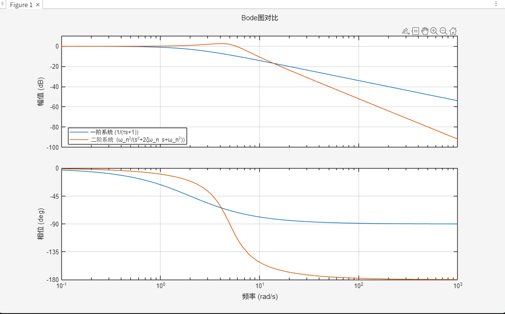
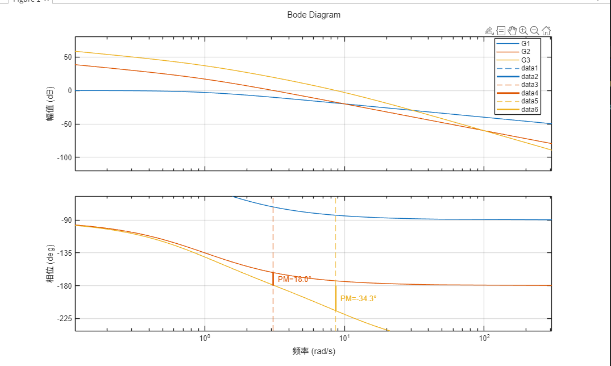
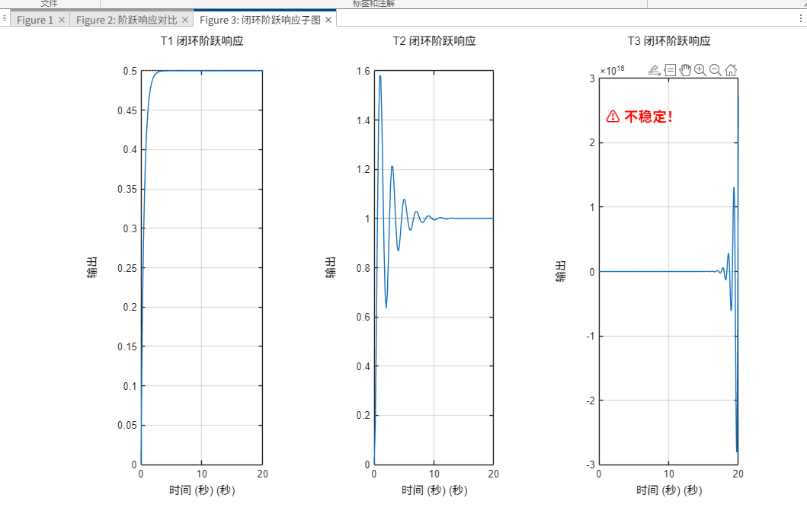
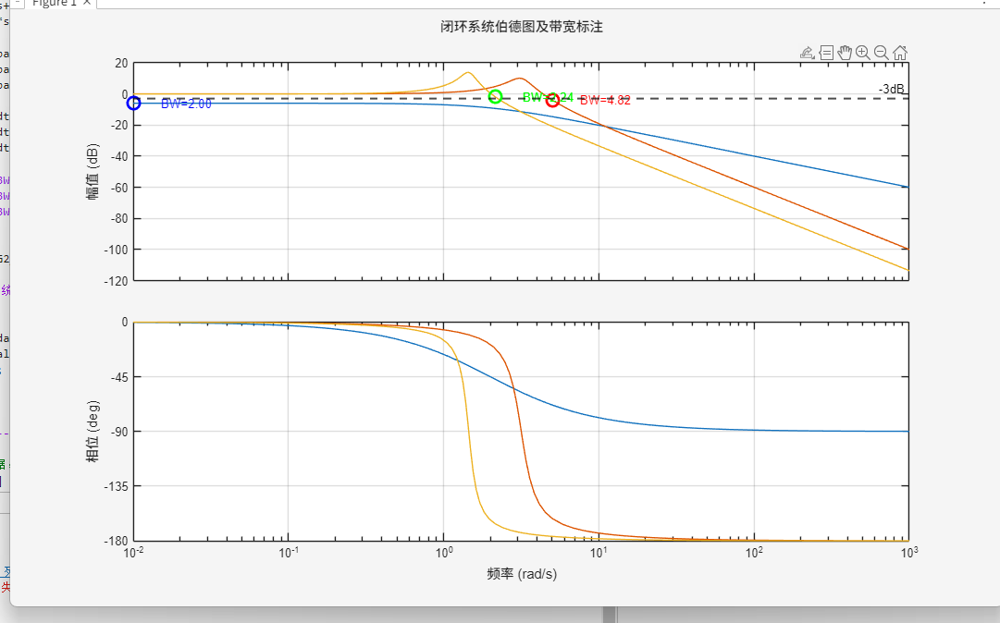
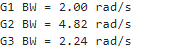
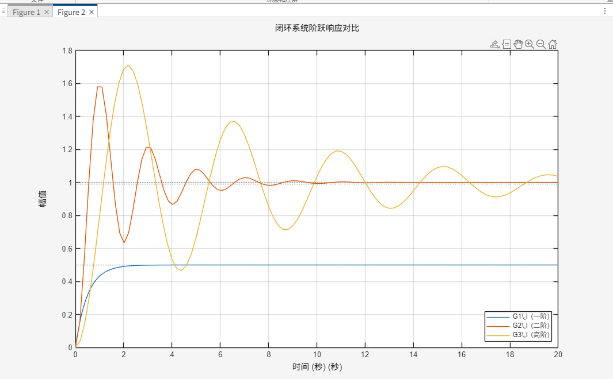

# 第2章 频域分析方法

> 工程逻辑：伯德图 → 提取指标 → 判定稳定性。频域是根基，时域是投影。

## 2.1 频域分析

### 2.1.1 频域数学基础

**傅里叶变换**（时域→频域）：
$$F(j\omega)=\int_{-\infty}^{\infty}f(t)e^{-j\omega t}dt$$

**任意时域信号的频域合成（傅里叶反变换）**：
$$f(t)=\frac{1}{2\pi}\int_{-\infty}^{\infty}F(j\omega)e^{j\omega t}d\omega$$

**线性时不变系统频域响应**：
$$Y(j\omega)=G(j\omega)U(j\omega)$$

**开环函数到闭环函数**
$$\Phi(s) = \frac{G(s)}{1+G(s)}  \tag{1}$$

**阶跃响应（$u(t)=1$）的频域投影**：
$$y_{step}(t)=\mathcal{L}^{-1}\left\{G(s)\cdot\frac{1}{s}\right\}$$

**核心定论**：
$$y_{step}(t) \xleftarrow{\text{投影}} G(j\omega)$$
    时域指标（超调量 $\sigma\%$、调节时间 $t_s$）均为频域特性（$PM$、$\omega_{bw}$、$M_r$）的被动映射。频域特性决定系统本质，任何时域信号均可分解为无数频率正弦波的叠加。时域响应只是频域响应在特定输入下的投影。掌握了系统的频域特性，就能推导出系统对所有时域输入的响应行为。

### 2.1.2 时域的局限

- 阶跃响应不振荡，不代表系统稳定（可能处于临界稳定，轻微扰动即发散）
- 上升时间受输入幅值影响，无法表征系统的响应极限
- 时域若有微小振荡，难以定位源头（摩擦？间隙？机械共振？）

### 2.1.3 频域指标

| 问题 | 频域指标直接回答 |
| :--- | :--- |
| 多稳？ | 相角裕度 PM 直接度量稳定性安全边际 |
| 多块？ | 带宽 $\omega_{bw}$ 决定响应速度的物理上限 |
| 多抖？ | 谐振峰 $M_r$ 暴露共振频率位置 |

- **幅频曲线**：增益随频率变化 → 找 **0dB 穿越点 ωc**  
- **相频曲线**：相位滞后随频率变化 → 找 **-180° 穿越点**  
- **三段解读法**：
  - 低频段：斜率决定系统型别（积分环节数）→ 稳态精度  
  - 中频段：ωc 与 PM → 稳定性与快速性  
  - 高频段：滚降速率 → 抗噪能力与机械谐振风险

## 2.2 频域分析核心：伯德图

    直接通过伯德图，就可以分析闭环系统的性能。

### 2.2.2 伯德图的两条曲线

| 轴 | 定义 | 刻度类型 | 关键点 |
| :--- | :--- | :--- | :--- |
| **横轴（X轴）** | 频率 $\omega$ | **对数刻度**（$\lg \omega$） | 十倍频程（dec）等间距，常用标记：0.01、0.1、1、10、100、1000 |
| **左纵轴（Y1）** | 幅值 $G(j\omega)$ | **线性刻度**（单位：dB） | $20\lg(\text{模})$，0dB 对应增益为 1 |
| **右纵轴（Y2）** | 相位 $\angle G(j\omega)$ | **线性刻度**（单位：°） | 参考线：0°、-90°、-180° |

### 2.2.3 伯德图三段解读法

| 频段 | 关注什么 | 反映什么 |
| :--- | :--- | :--- |
| 低频段（起始斜率） | -20dB/dec 的个数 | 系统型别（积分环节数），决定稳态精度 |
| 中频段（穿越 0dB 附近） | 穿越频率 $\omega_c$ 和 PM | 系统的稳定性和快速性 |
| 高频段（末端斜率） | 滚降速率和峰值 | 抗噪能力和机械谐振风险 |

### 2.3.4 一阶系统和二阶系统的伯德图

分析实例：$$G(s)=\frac{1}{s+1}$$
$$G(s)=\frac{5^2}{s^2 + 4s + 5^2}$$

在matlab中运行[tesk1.m](.\tesk1.m),可得:

## 2.3 核心指标一：相角裕度 PM

### 2.3.1 核心定义

$$PM = 180° + \angle G(j\omega_c)$$

其中 $\omega_c$ 为开环幅频穿越 0dB 时的频率（穿越频率）。

### 2.3.2 PM 决定稳定性的物理意义

反馈控制的本质是用误差去消除误差。信号在环路中走一圈，必然经历相位滞后。

- 负反馈求和点的运算是 **E = R - Y**，前提是反馈信号 Y 与输入 R 同相（相差 0°）。
- 当某一频率处的相位滞后达到 180° 时，Y 的符号完全反转，数学上等效于 **-|Y|**。
- 此时误差方程变为：**E = R - (-|Y|) = R + |Y|**。
- 减法变成加法，负反馈强制转为正反馈。
- 当该频率点的开环增益刚好为 1（0dB）时，系统不需要外部输入，仅靠环路内部的正反馈叠加即可维持等幅振荡（临界稳定）。

**PM 的直接物理含义**：

PM 度量的是系统在增益穿越 0dB 的那个频率点上，距离"变成正反馈"（相位滞后 180°）还差多少度。这个相位余量直接决定了闭环极点的分布区域：

| PM 值 | 闭环极点位置 | 系统行为 |
| :--- | :--- | :--- |
| PM > 0° | 全部在左半平面 | 收敛 |
| PM = 0° | 在虚轴上 | 等幅振荡 |
| PM < 0° | 进入右半平面 | 发散 |

PM 越大，闭环极点越远离虚轴、越靠近负实轴，阻尼越强，超调越小。

### 2.3.3 工程评判标准

| PM 范围 | 工程含义 |
| :--- | :--- |
| $> 60°$ | 很稳，但响应偏慢 |
| $45° \sim 60°$ | 稳健，**工程首选** |
| $30° \sim 45°$ | 可用，超调明显 |
| $< 30°$ | 危险，严重震荡 |

### 2.3.4 实例：三个系统 PM 对比

**系统定义**：

$$G_1(s)=\frac{1}{s+1},\quad G_2(s)=\frac{10}{s(s+1)},\quad G_3(s)=\frac{100}{s(s+1)(0.1s+1)}$$

#### \(G_1(s)\)
- 积分环节数：\(v=0\)，无纯积分项 \(s\)
- 零点节数：\(z=0\)，分子为常数，不含一阶零点因式
- 极点：\(s=-1\)，一阶惯性环节
- 相频特性：\(\angle G_1(j\omega) = -\arctan\omega\)，\(\lim\limits_{\omega \to 0} \angle G_1(j\omega) = 0^\circ\)，\(\lim\limits_{\omega \to +\infty} \angle G_1(j\omega) = -90^\circ\)
相位滞后小于90°，相位裕度 \(\gamma>90^\circ\)，阻尼极强，几乎无超调。

#### \(G_2(s)\)
- 积分环节数：\(v=1\)，分母含 \(s^1\)
- 零点节数：\(z=0\)，无零点
- 极点：\(s=0,\;s=-1\)
- 相频特性：\(\angle G_2(j\omega) = -90^\circ - \arctan\omega\)
由幅值条件 \(\dfrac{10}{\omega_c\sqrt{\omega_c^2+1}}=1\) 得 \(\omega_c\approx3.242\)
\[
\angle G_2(j\omega_c)\approx-162.86^\circ,\quad \gamma\approx17.14^\circ
\]相位裕度偏小，闭环振荡明显，超调量大。

#### \(G_3(s)\)
- 积分环节数：\(v=1\)，分母含 \(s^1\)
- 零点节数：\(z=0\)，无零点
- 极点：\(s=0,\;s=-1,\;s=-10\)
- 相频特性：\(\angle G_3(j\omega) = -90^\circ - \arctan\omega - \arctan(0.1\omega)\)
多一阶惯性带来额外相位滞后，剪切频率更高，总相位滞后小于 \(-180^\circ\)，相位裕度为负，闭环不稳定。

### 3. 参数汇总表
| 系统 | 积分环节数 | 零点节数 | 预期 PM |
| :--- | :--- | :--- | :--- |
| \(G_1(s)=\dfrac{1}{s+1}\) | 0 | 0 | \(\gamma>90^\circ\)，相位裕度极大 |
| \(G_2(s)=\dfrac{10}{s(s+1)}\) | 1 | 0 | \(\gamma\approx17.14^\circ\)，相位裕度偏小 |
| \(G_3(s)=\dfrac{100}{s(s+1)(0.1s+1)}\) | 1 | 0 | \(\gamma<0^\circ\)，相位裕度为负，闭环不稳定 |

**MATLAB 验证**：[tesk1.m](.\tesk1.m)

伯德图：

符合预测结果。

## 2.4 闭环带宽 $\omega_{bw}$

### 2.4.1 核心定义

闭环幅频下降 3dB 处的频率：

$$\boxed{|G_{cl}(j\omega_{bw})| = \frac{1}{\sqrt{2}}|G_{cl}(0)|} \tag{2}$$

物理意义:
- **决定反应速度**：ωc 越大，系统响应越快（调节时间 ≈ 3/ωc）。

- **跟踪能力的边界**：低于 ωc 的信号能准确跟踪，高于 ωc 的信号输出衰减（-3dB）。

- **快速性与抗噪性的折中**：带宽越大，系统越灵敏，但也越容易传递高频噪声到执行器。

### 2.4.2 二阶系统精确公式（仅作参考）

$$\omega_{bw} = \omega_n\sqrt{(1-2\zeta^2)+\sqrt{(1-2\zeta^2)^2+1}}$$

$\zeta=0.7$ 工程近似：

$$\omega_{bw} \approx 1.4\,\omega_n \quad (\zeta=0.7)$$

### 2.4.3 硬约束条件

机械谐振约束：

$$\omega_{bw} < \frac{1}{2}\omega_r$$

采样频率约束：

$$\omega_{bw} < \frac{1}{10}\omega_s$$

### 2.4.4 实例：三个系统的带宽对比

**系统定义**：

$$G_1(s)=\frac{1}{s+1},\quad G_2(s)=\frac{10}{s(s+1)},\quad G_3(s)=\frac{100}{(5s+1)(8s+1)}$$

由公式(1)得,**闭环传递函数**:

$$G_{1,cl}(s)=\frac{1}{s+2}$$

$$G_{2,cl}(s)=\frac{10}{s^2+s+10}$$

$$G_{3,cl}(s)=\frac{100}{40s^2+13s+101}$$

**理论分析**：
| 系统 | 闭环传递函数 | 闭环极点 | $\omega_n$ | $\zeta$ | 带宽 |
| :--- | :--- | :--- | :--- | :--- | :--- |
| $G_1$ | $\frac{1}{s+2}$ | $s=-2$ | $2.00$ | $1.0$ | **2.00** rad/s |
| $G_2$ | $\frac{10}{s^2+s+10}$ | $s=-0.5 \pm 3.122j$ | $3.16$ | $0.158$ | **4.82** rad/s |
| $G_3$ | $\frac{100}{40s^2+13s+101}$ | $s=-0.1625 \pm 1.586j$ | $1.589$ | $0.102$ | **2.24** rad/s |

$G_1$ 为一阶系统，带宽由闭环极点 $s=-2$ 决定：$\omega_{bw}=2$ rad/s。

$G_2$ 为二阶系统，$\omega_n=\sqrt{10}\approx3.16$，$\zeta=\frac{1}{2\omega_n}\approx0.158$，由公式（2）可得，带宽约为 $4.82$ rad/s。

$G_3$ 为二阶系统 ，$\omega_n=\sqrt{2.525}\approx1.589$，$\zeta=\frac{0.325}{2\omega_n}\approx0.102$，由公式（2）可得，带宽约为 $2.24$ rad/s。

**MATLAB 验证**：[tesk3.m](./tesk3.m)

- **带宽由闭环主导极点决定，而非开环增益。**

- **带宽与响应速度正相关：带宽越大，阶跃响应上升越快。**

## 2.5 谐振峰 \( M_r \)

### 2.5.1 核心定义

频响幅值的最大值：

$$\boxed{M_r = \max_{\omega} |G_{cl}(j\omega)|}$$

物理意义：
- **衡量系统的"冲动程度"**：\( M_r \) 越大，系统在特定频率下对输入信号的放大作用越强，输出超调越严重。

- **反映系统的稳定裕度**：\( M_r \) 越大，系统越接近不稳定边缘（工程上通常要求 \( M_r < 1.4 \)，对应约 60° 相角裕度）。

- **暴露系统的"固有频率"**：谐振峰出现的频率接近系统的无阻尼自然频率，此时系统内部储能元件（质量-弹簧、电容-电感）之间的能量交换最剧烈。

### 2.5.2 二阶系统精确公式

谐振频率：

$$\omega_r = \omega_n\sqrt{1-2\zeta^2} \quad (0 < \zeta \le 0.707)$$

谐振峰值：

$$M_r = \frac{1}{2\zeta\sqrt{1-\zeta^2}}$$

### 2.5.3 实例：三个系统的谐振峰对比

**系统定义**：

$$G_1(s)=\frac{1}{s+1},\quad G_2(s)=\frac{10}{s(s+1)},\quad G_3(s)=\frac{100}{(5s+1)(8s+1)}$$

由公式(1)得，**闭环传递函数**：

$$G_{1,cl}(s)=\frac{1}{s+2}$$

$$G_{2,cl}(s)=\frac{10}{s^2+s+10}$$

$$G_{3,cl}(s)=\frac{100}{40s^2+13s+101}$$

**理论分析**：

| 系统 | 闭环传递函数 | \(\omega_n\) | \(\zeta\) | \(\omega_r\) | \(M_r\) | 有无谐振峰 |
| :--- | :--- | :--- | :--- | :--- | :--- | :--- |
| \(G_1\) | \(\frac{1}{s+2}\) | — | 1.0（过阻尼） | 无 | 无（单调衰减） | ❌ 无 |
| \(G_2\) | \(\frac{10}{s^2+s+10}\) | 3.16 | 0.158 | **3.00** rad/s | **3.20**（10.1 dB） | ✅ 有 |
| \(G_3\) | \(\frac{100}{40s^2+13s+101}\) | 1.589 | 0.102 | **1.575** rad/s | **4.93**（13.9 dB） | ✅ 有（更大） |

**计算过程**：

- **\( G_1 \)（一阶系统）**：闭环极点 \(s=-2\) 在实轴上，无复极点。幅频特性单调下降，不存在峰值，因此 **无谐振峰**。

- **\( G_2 \)（二阶欠阻尼）**：\(\omega_n=\sqrt{10}\approx3.16\)，\(\zeta=\frac{1}{2\omega_n}\approx0.158<0.707\)。

  $$\omega_r = \omega_n\sqrt{1-2\zeta^2} = 3.16 \times \sqrt{1-2\times0.158^2} \approx 3.00 \text{ rad/s}$$

  $$M_r = \frac{1}{2\zeta\sqrt{1-\zeta^2}} = \frac{1}{2\times0.158\times\sqrt{1-0.158^2}} \approx 3.20 \text{（约 10.1 dB）}$$

- **\( G_3 \)（二阶欠阻尼）**：\(\omega_n=\sqrt{101/40}\approx1.589\)，\(\zeta=\frac{13}{2\sqrt{40\times101}}\approx0.102<0.707\)。

  $$\omega_r = \omega_n\sqrt{1-2\zeta^2} = 1.589 \times \sqrt{1-2\times0.102^2} \approx 1.575 \text{ rad/s}$$

  $$M_r = \frac{1}{2\zeta\sqrt{1-\zeta^2}} = \frac{1}{2\times0.102\times\sqrt{1-0.102^2}} \approx 4.93 \text{（约 13.9 dB）}$$

**MATLAB 验证**：[task3.m](./task3.m)

**关键结论**：

- **谐振峰仅存在于欠阻尼（\(\zeta<0.707\)）二阶系统中**：\(G_1\) 极点全在实轴，无谐振峰；\(G_2\)、\(G_3\) 存在共轭复极点，故出现谐振峰。

- **阻尼比越小，谐振峰越大，系统越"暴躁"**：\(G_3\) 的 \(\zeta=0.102\) 远小于 \(G_2\) 的 \(\zeta=0.158\)，其谐振峰 \(M_r=4.93\) 也远大于 \(G_2\) 的 \(3.20\)，对应阶跃响应超调更严重、震荡更剧烈。

- **谐振峰频率接近无阻尼自然频率**：\(\omega_r \approx \omega_n\)（当 \(\zeta\) 很小时），此时系统内部储能交换最剧烈。

## 2.6 本章总结

### 2.6.1 三大频域指标速查表

| 指标 | 符号 | 定义 | 工程意义 | 工程建议值 |
| :--- | :--- | :--- | :--- | :--- |
| **相角裕度** | $PM$ | $180° + \angle G(j\omega_c)$ | 稳定性安全边际 | $45° \sim 60°$ |
| **闭环带宽** | $\omega_{bw}$ | 幅频下降 3dB 处频率 | 响应速度上限 | 越大越快，受机械/采样约束 |
| **谐振峰** | $M_r$ | $\max \|G_{cl}(j\omega)\|$ | 共振剧烈程度 | $< 1.4$（约 3dB） |

### 2.6.2 一阶与二阶系统标准公式汇总

| 参数 | 一阶系统 $G(s)=\dfrac{K}{Ts+1}$ | 二阶系统 $G(s)=\dfrac{\omega_n^2}{s^2+2\zeta\omega_n s+\omega_n^2}$ |
| :--- | :--- | :--- |
| 穿越频率 $\omega_c$ | $\dfrac{\sqrt{K^2-1}}{T}$（$K>1$） | 由 $\|G(j\omega_c)\|=1$ 数值求解 |
| 相角裕度 $PM$ | $90° - \arctan(\omega_c T)$ | $\arctan\left(\dfrac{2\zeta}{\sqrt{\sqrt{4\zeta^4+1}-2\zeta^2}}\right)$ |
| 闭环带宽 $\omega_{bw}$ | $\dfrac{1}{T}\sqrt{2K^2-1}$ | $\omega_n\sqrt{(1-2\zeta^2)+\sqrt{(1-2\zeta^2)^2+1}}$ |
| 谐振频率 $\omega_r$ | **无** | $\omega_n\sqrt{1-2\zeta^2}$（$\zeta \le 0.707$） |
| 谐振峰值 $M_r$ | **无**（单调衰减） | $\dfrac{1}{2\zeta\sqrt{1-\zeta^2}}$（$\zeta \le 0.707$） |
| 有无振荡 | **永不振荡** | $\zeta < 1$ 时有振荡，$\zeta \ge 1$ 时无振荡 |

### 2.6.3 核心结论

1. **频域是本质，时域是投影**：所有时域响应均可由频域特性推得，频域指标直接决定系统本质行为。

2. **PM 是稳定性的"体温计"**：PM 直接度量系统距离正反馈崩溃边缘的相位余量，是稳定性最直观的度量。工程首选 $45° \sim 60°$。

3. **$\omega_{bw}$ 是速度的"上限"**：带宽决定系统能响应的最快信号频率，带宽越大响应越快，但必须受机械谐振（$\omega_{bw} < \omega_r/2$）和采样频率（$\omega_{bw} < \omega_s/10$）的硬约束。

4. **$M_r$ 是阻尼的"镜子"**：$M_r$ 越大，阻尼越小，超调越严重。$M_r < 1.4$（$< 3$ dB）是工程红线，$\zeta=0.7$（$M_r \approx 1$，$PM \approx 65°$）是最佳阻尼比。

5. **一阶系统最安全，二阶系统最经典**：一阶系统永不振荡，是最安全的动态环节；二阶系统覆盖了从过阻尼到欠阻尼的全部动态行为，是工程分析与设计的核心模板。