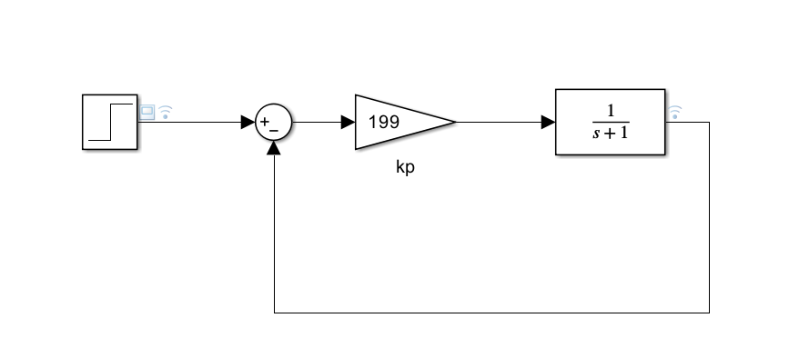

# 控制器选型与系统匹配手册

## 被控对象标准型

### 一阶系统
$$G(s)=\frac{1}{Ts+1}$$

- 极点：$s=-1/T$，$\omega_p=1/T$

示例：$G(s)=\dfrac{1}{s+1}$，$T= 0.001s$
**阶跃响应** :  

### 二阶系统
$$G(s)=\frac{\omega_n^2}{s^2+2\zeta\omega_n s+\omega_n^2}$$

- 极点：$s=-\zeta\omega_n \pm j\omega_n\sqrt{1-\zeta^2}$

示例：$G(s)=\dfrac{2500}{s^2+40s+2500}$

其中 $\omega_n=50\text{rad/s}$，$\zeta=0.4$

## 1. P控制器

**适用**：一阶系统

$$G_c(s)=K_p$$

$$T(s)=\frac{G_c G}{1+G_c G}=\frac{K_p \cdot \frac{1}{Ts+1}}{1+K_p \cdot \frac{1}{Ts+1}}=\frac{K_p}{Ts+1+K_p}$$

- 直流增益：$T(0)=\frac{K_p}{1+K_p}$
- 带宽 $\omega_b$ 满足：$|T(j\omega_b)| = \frac{1}{\sqrt{2}}|T(0)|$

代入：

$$\frac{K_p}{\sqrt{(1+K_p)^2+(T\omega_b)^2}} = \frac{1}{\sqrt{2}}\cdot \frac{K_p}{1+K_p}$$

$$(1+K_p)^2 = (T\omega_b)^2$$

取正数解：

$$\boxed{1+K_p = T\omega_b \quad \Longrightarrow \quad K_p = \omega_b T - 1}$$

**结论**：$-1$ 来自单位反馈分母中的固有常项 $1$。

$$K_p=\omega_b T - 1$$

| 特性 | 说明 |
|:---|:---|
| 静差 | 有，$e_{ss}=1/(1+K_p)$ |
| 稳定性 | $K_p$过大易震荡 |

示例系统：
    设计带宽$w_b = 200 rad/s$,
$$T = 1$$
则令 $$K_P = 200 * 1 - 1  = 199$$

simulink：

则带宽为200rad/s,符合理论分析

## 2. PD控制器

**适用**：一阶系统

$$G_c(s)=K_d s+K_p=K_d(s+\omega_z)$$

令控制器零点抵消被控对象极点，需 $K_d /T = K_p$（即零点 $\omega_z = 1/T$）。

此时闭环：

$$T(s)=\frac{(K_p+K_d s)\cdot \frac{1}{Ts+1}}{1+(K_p+K_d s)\cdot \frac{1}{Ts+1}}
=\frac{K_p+K_d s}{Ts+1+K_p+K_d s}$$

代入 $K_d = K_p T$：

$$T(s)=\frac{K_p(Ts+1)}{(Ts+1)(1+K_p)}=\frac{K_p}{1+K_p}$$

**关键问题**：闭环退化为**纯比例常数**（无动态环节），理论上带宽为无穷大（$|T(j\omega)|$ 恒等于 $|T(0)|$，永不衰减至 -3dB）。

因此手册中的 $K_p = \omega_b$ **并非由带宽方程解出**，而是**工程上人为将前向增益标定为目标带宽数值**（以统一设计口径），进而：

$$\boxed{K_p = \omega_b,\quad K_d = K_p T = \omega_b T}$$

| 特性 | 说明 |
|:---|:---|
| 静差 | 有 |
| 噪声 | 微分项放大高频噪声严重 |
| 二阶系统 | 有限适用 |

## 3. PI控制器 一阶标准

**适用**：一阶系统（最优匹配）

$$G_{PI}(s)=K_p+\frac{K_i}{s}=\frac{K_p s+K_i}{s}$$

**零极点对消条件**：令分子零点抵消对象极点 $s=-1/T$，即：

$$\frac{K_i}{K_p} = \frac{1}{T} \quad \Longrightarrow \quad K_p = K_i T$$

代入控制器：

$$G_{PI}(s)=\frac{K_i T s + K_i}{s}=\frac{K_i(Ts+1)}{s}$$

与被控对象 $G(s)=\frac{1}{Ts+1}$ 相乘（开环）：

$$L(s)=G_{PI}\cdot G = \frac{K_i(Ts+1)}{s}\cdot \frac{1}{Ts+1} = \frac{K_i}{s}$$

闭环传递函数：

$$T(s)=\frac{L(s)}{1+L(s)}=\frac{K_i/s}{1+K_i/s}=\frac{K_i}{s+K_i}$$

这是一个标准一阶低通，其 -3dB 带宽恰好等于 $K_i$（因为 $|T(jK_i)| = K_i/\sqrt{K_i^2+K_i^2}=1/\sqrt{2}$）。

令带宽为目标值 $\omega_b$：

$$\boxed{K_i = \omega_b}$$

代回对消条件：

$$\boxed{K_p = K_i T = \omega_b T}$$
零极点对消：$\omega_z=\omega_p=1/T$

$$\boxed{K_p=\omega_b T,\quad K_i=\omega_b}$$

| 特性 | 说明 |
|:---|:---|
| 静差 | ✅无 |
| 超调 | 无（闭环一阶） |
| 积分饱和 | 必须加抗饱和处理 |
| 二阶系统 | 仅主导极点近似时可用 |

## 4. PID控制器 ⭐二阶标准

**适用**：二阶系统（标准匹配）

$$G_{PID}(s)=K_p+\frac{K_i}{s}+K_d s=K_d\cdot\frac{(s+\omega_{z1})(s+\omega_{z2})}{s}$$

被控对象分母：$s^2+2\zeta\omega_n s+\omega_n^2 = (s+p_1)(s+p_2)$。

**双零点对消条件**：令控制器二次多项式完全抵消对象分母：

$$K_d s^2+K_p s+K_i = K_d(s+p_1)(s+p_2)$$

展开对比系数：

$$K_p = K_d(p_1+p_2),\qquad K_i = K_d\cdot p_1 p_2 = K_d\omega_n^2$$

代入控制器：

$$G_{PID}(s)=\frac{K_d(s+p_1)(s+p_2)}{s}$$

与被控对象 $G(s)=\frac{\omega_n^2}{(s+p_1)(s+p_2)}$ 相乘（开环）：

$$L(s)=\frac{K_d(s+p_1)(s+p_2)}{s}\cdot \frac{\omega_n^2}{(s+p_1)(s+p_2)}=\frac{K_d\omega_n^2}{s}$$

闭环传递函数：

$$T(s)=\frac{L(s)}{1+L(s)}=\frac{K_d\omega_n^2}{s+K_d\omega_n^2}$$

同样，这是一阶低通，其 -3dB 带宽为 $K_d\omega_n^2$。令其等于 $\omega_b$：

$$K_d\omega_n^2 = \omega_b \quad \Longrightarrow \quad \boxed{K_d = \frac{\omega_b}{\omega_n^2}}$$

代回系数对比式：

$$\boxed{K_p = \frac{\omega_b(p_1+p_2)}{\omega_n^2} = \frac{2\zeta\omega_b}{\omega_n}}$$

$$\boxed{K_i = K_d\omega_n^2 = \omega_b}$$

零极点对消：$\omega_{z1}=p_1,\ \omega_{z2}=p_2$

$$\boxed{K_d=\frac{\omega_b}{\omega_n^2},\quad K_p=\frac{\omega_b(p_1+p_2)}{\omega_n^2},\quad K_i=\omega_b}$$

| 特性 | 说明 |
|:---|:---|
| 静差 | ✅无 |
| 动态 | 微分调节阻尼，抑制超调 |
| 复杂度 | 三参数整定 |
| 一阶系统 | ❌禁用（过设计） |

## 5. 参数速查表

| 控制器 | 适用 | $K_p$ | $K_i$ | $K_d$ | 静差 |
|:---:|:---:|:---:|:---:|:---:|:---:|
| P | 一阶 | $\omega_b T-1$ | — | — | 有 |
| PD | 一阶 | $\omega_b$ | — | $\omega_b T$ | 有 |
| PI | 一阶 | $\omega_b T$ | $\omega_b$ | — | 无 |
| PID | 二阶 | $\frac{\omega_b(p_1+p_2)}{\omega_n^2}$ | $\omega_b$ | $\frac{\omega_b}{\omega_n^2}$ | 无 |

## 6. 设计实例

### 实例一：一阶系统 + PI

**给定**：$G(s)=\dfrac{1}{s+1}$，$T= 0.001s$

**目标**：$\omega_b=200\text{rad/s}$，无超调，零静差

**选型**：PI控制器

**计算**：

$$\omega_p=\frac{1}{T}=1$$

$$K_p=\omega_b T=200 * 1=200$$

$$K_i=\omega_b=200$$

**结果**：

$$\boxed{K_p=2,\quad K_i=200}$$

**验证**：

$$G_{close}(s)=\frac{200}{s+200}$$

上升时间 $t_r\approx 2.2/200=11\text{ms}$，无超调，零静差 ✅

### 实例二：二阶系统 + PID

**给定**：$G(s)=\dfrac{2500}{s^2+40s+2500}$

其中 $\omega_n=50\text{rad/s}$，$\zeta=0.4$

**目标**：$\omega_b=100\text{rad/s}$，零静差

**选型**：PID控制器

**计算**：

极点：
$$p_{1,2}=\zeta\omega_n \pm j\omega_n\sqrt{1-\zeta^2}=20\pm j45.8$$

$$p_1+p_2=2\zeta\omega_n=40$$

$$\omega_n^2=2500$$

$$K_d=\frac{\omega_b}{\omega_n^2}=\frac{100}{2500}=0.04$$

$$K_p=\frac{\omega_b(p_1+p_2)}{\omega_n^2}=\frac{100\times40}{2500}=1.6$$

$$K_i=\omega_b=100$$

**结果**：

$$\boxed{K_p=1.6,\quad K_i=100,\quad K_d=0.04}$$

**验证**：

闭环传递函数退化为：

$$G_{close}(s)=\frac{100}{s+100}$$

上升时间 $t_r\approx 22\text{ms}$，无超调，零静差 ✅

## 7. 工程要点

| 序号 | 要点 |
|:---:|:---|
| 1 | **一阶→PI，二阶→PID**，P/PD不推荐闭环控制 |
| 2 | 零点对消口诀：**控制器零点 = 被控对象极点** |
| 3 | 带宽约束：$\omega_b \le \omega_s/5$（采样频率的1/5） |
| 4 | 离散化优先用**增量式PI**，天然抗积分饱和 |
| 5 | 参数温漂时预留20%~30%带宽裕度 |
| 6 | **积分饱和必处理**：输出限幅+积分分离 |