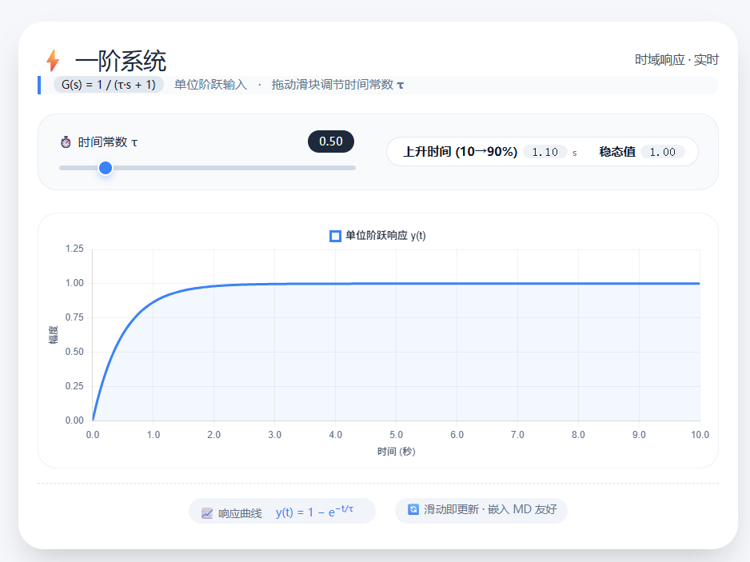
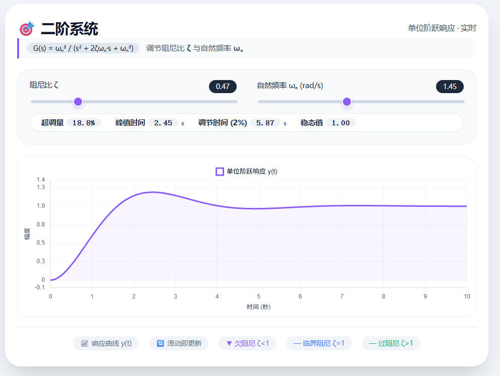
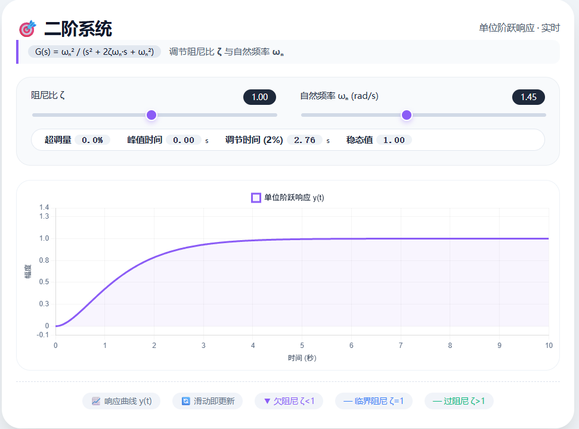
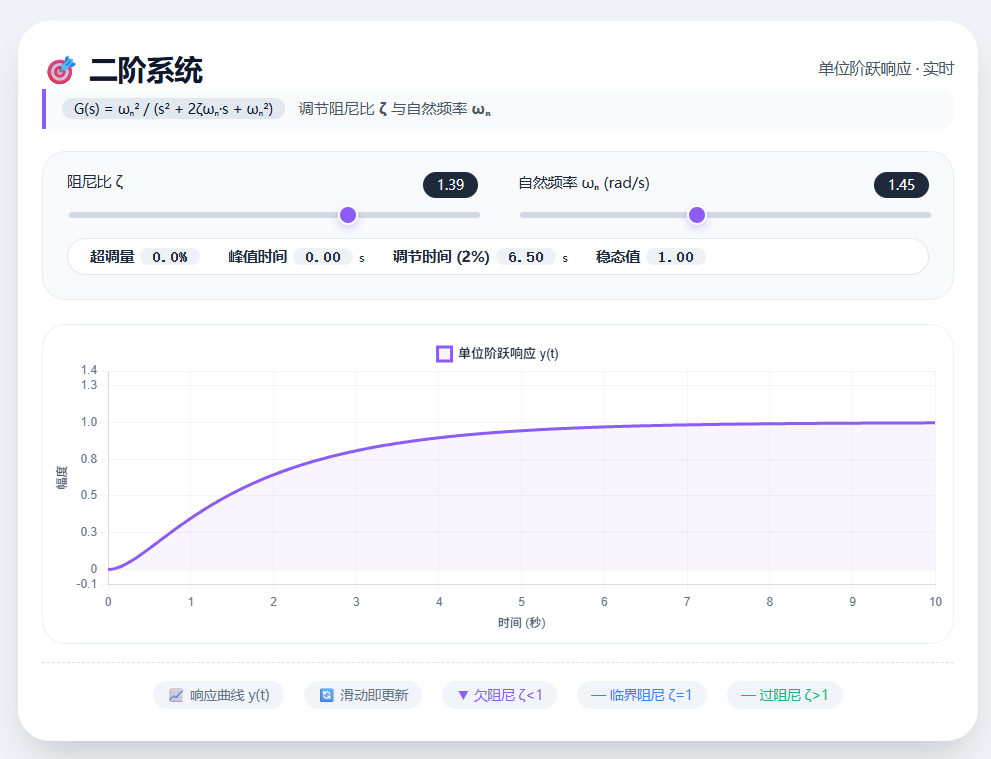
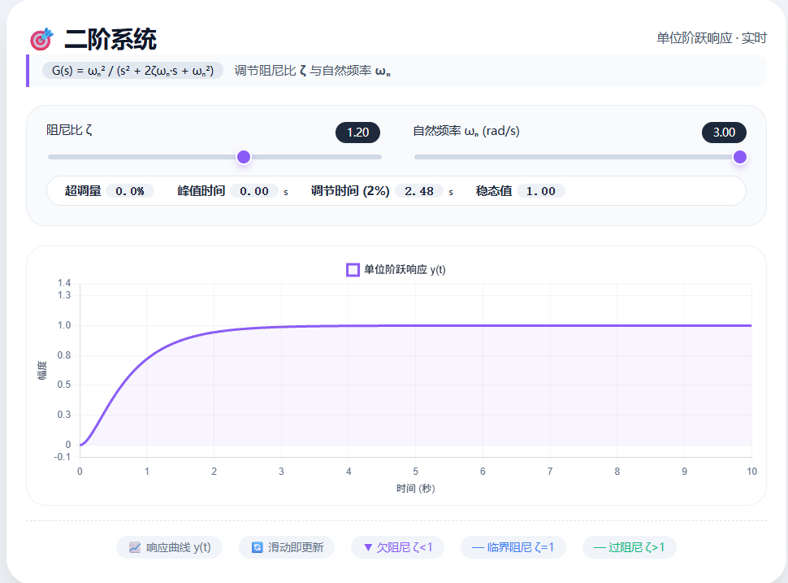
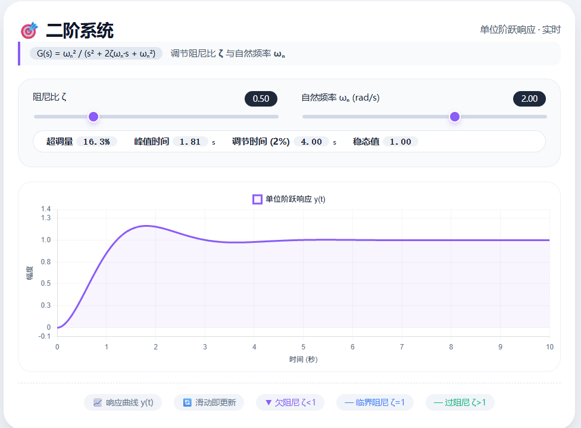

# 控制系统建模基础

## SISO系统（单输入单输出系统）

**摘要**：对单输入单输出系统进行举例说明和展示，主要聚焦于工程中常用的一阶、二阶模型。

---

### 一阶系统

对该系统输入单位阶跃信号，其输出响应为：
$$y(t) = 1 - e^{-\frac{t}{T}}$$

> 交互式模型演示：[一阶模型交互文件](./一阶模型.html)

对时域响应进行拉普拉斯变换，可得传递函数：
$$G(s)=\frac{1}{Ts+1}$$

#### 系统特征参数

- 极点：$s = -1/T$
- 极点对应频率：$\omega_p = 1/T$

#### 动态特性说明

- 一阶系统的输出响应**不存在超调**，因此一阶系统也被称为**惯性系统**，其响应速度完全取决于时间常数 $T$ 的大小。
- 上升时间（10%~90% 标准定义）：$t_r \approx 2.2T$
- 调节时间（0~100% 全区间）：$t_s \approx 3T$

#### 实例计算

取时间常数 $T = 0.5\ \text{s}$，代入公式可得：
$$t_r \approx 2.2 \times 0.5 = 1.1\ \text{s}$$

> 系统阶跃响应曲线示意：
> 

---
### 二阶系统

对标准二阶系统输入单位阶跃信号，其时域输出响应因阻尼比 $\zeta$ 的不同而呈现不同形式。以典型欠阻尼系统为例，其输出响应为：
$$y(t) = 1 - \frac{e^{-\zeta \omega_n t}}{\sqrt{1-\zeta^2}} \sin\left(\omega_d t + \arctan\frac{\sqrt{1-\zeta^2}}{\zeta}\right)$$

其中，$\omega_d = \omega_n \sqrt{1-\zeta^2}$ 为阻尼振荡频率。

> 交互式模型演示：[二阶模型交互文件](./二阶模型.html)

对时域响应进行拉普拉斯变换，可得二阶系统标准传递函数：
$$G(s)=\frac{\omega_n^2}{s^2 + 2\zeta\omega_n s + \omega_n^2}$$

#### 系统特征参数
- 特征方程：$s^2 + 2\zeta\omega_n s + \omega_n^2 = 0$
- 极点：$s_{1,2} = -\zeta\omega_n \pm j\omega_n\sqrt{1-\zeta^2}$（欠阻尼状态）
- 自然频率：$\omega_n$
- 阻尼比：$\zeta$

#### 动态特性说明
二阶系统的响应特性由阻尼比 $\zeta$ 决定，可分为以下三种情况：

取相同的自然频率
- 欠阻尼，$0 < \zeta < 1$
- 临界阻尼，$\zeta = 1$
- 过阻尼，$\zeta > 1$

提高自然频率
- 过阻尼

**观察上述所有情况，我们定性得到，阻尼比 决定超调量，自然频率决定相应速度，因此对2阶系统，其时域性能指标如下：**
- 上升时间（0~100%）：$t_r \approx \dfrac{1.8}{\omega_n}$
- 峰值时间：$t_p = \dfrac{\pi}{\omega_n\sqrt{1-\zeta^2}}$
- 最大超调量：$M_p = e^{-\pi\zeta/\sqrt{1-\zeta^2}} \times 100\%$
- 调节时间（2% 误差带）：$t_s \approx \dfrac{4}{\zeta\omega_n}$
- 调节时间（5% 误差带）：$t_s \approx \dfrac{3}{\zeta\omega_n}$

#### 实例计算
取自然频率 $\omega_n = 2\ \text{rad/s}$，阻尼比 $\zeta = 0.5$（欠阻尼系统），代入性能指标公式可得：

- 峰值时间：
$$t_p = \frac{\pi}{2 \times \sqrt{1-0.5^2}} = \frac{\pi}{2 \times 0.866} \approx 1.81\ \text{s}$$

- 最大超调量：
$$M_p = e^{-\pi \times 0.5 / \sqrt{1-0.5^2}} \times 100\% = e^{-1.814} \times 100\% \approx 16.3\%$$

- 调节时间（2% 误差带）：
$$t_s \approx \frac{4}{0.5 \times 2} = 4\ \text{s}$$

该算例表明：当二阶系统自然频率为 $2\ \text{rad/s}$、阻尼比为 $0.5$ 时，峰值时间约为 $1.81\ \text{s}$，最大超调量约为 $16.3\%$，调节时间约为 $4\ \text{s}$。

---

## 高阶系统

### 从低阶到高阶的过渡

前面我们讨论了一阶和二阶系统，它们的动态特性可以用少数几个参数（时间常数、阻尼比、自然频率）完整描述。然而，实际工程中的系统往往更为复杂，通常需要用**高阶微分方程**来描述。

高阶系统的传递函数一般形式为：

$$G(s) = \frac{b_m s^m + b_{m-1} s^{m-1} + \cdots + b_1 s + b_0}{a_n s^n + a_{n-1} s^{n-1} + \cdots + a_1 s + a_0}, \quad m \leq n$$

其中 $n$ 为系统的**阶次**，$m$ 为分子阶次。

> 交互式模型演示：[高阶模型交互文件](./高阶模型.html)

---

### 主导极点（Dominant Poles）—— 高阶系统分析的核心思想

高阶系统的响应是**所有极点贡献的叠加**。但并非所有极点都同等重要。

**主导极点**是指那些**距离虚轴最近**（即实部绝对值最小）的极点，它们决定了系统响应的主要特性。距离虚轴越远的极点，其对应的瞬态分量衰减越快，对系统响应的贡献越小。

#### 主导极点判别准则

1. **距离虚轴最近的极点**（实部绝对值最小）
2. **附近没有零点**（零极点的相互抵消会影响主导性）
3. 如果最近极点的实部绝对值是其他极点的 **3~5 倍以上**，其他极点可以忽略

> 这就是为什么高阶系统可以用**等效二阶系统**来近似——找到主导极点，忽略非主导极点。

---

### 高阶系统的时域响应

对高阶系统施加单位阶跃输入，其输出响应可分解为：

$$y(t) = A_0 + \sum_{i=1}^{q} A_i e^{-\sigma_i t} + \sum_{j=1}^{r} e^{-\sigma_j t} \left( B_j \cos \omega_{dj} t + C_j \sin \omega_{dj} t \right)$$

其中：
- 第一项 $A_0$ 为**稳态分量**（由输入信号决定）
- 第二项为**实数极点**对应的指数衰减分量
- 第三项为**共轭复数极点**对应的振荡衰减分量

#### 分量主导性分析

| 极点位置 | 对应响应分量 | 衰减速度 | 主导性 |
|---------|-------------|---------|--------|
| $\sigma$ 很小（靠近虚轴） | 指数/振荡衰减慢 | 慢 | ⭐⭐⭐ **强主导** |
| $\sigma$ 中等 | 指数/振荡衰减中等 | 中等 | ⭐⭐ 次要 |
| $\sigma$ 很大（远离虚轴） | 指数/振荡衰减快 | 快 | ⭐ 可忽略 |

---

### 零点对高阶系统的影响

高阶系统的**零点**虽然不影响极点位置，但会改变各分量的**系数（留数）**，从而影响响应的形状。

- **靠近极点的零点**：会削弱该极点对应的响应分量
- **远离极点的零点**：影响较小，可近似忽略
- **右半平面零点（非最小相位系统）**：会导致初始响应方向反转（下冲）

---

### 高阶系统的简化方法

#### 方法一：主导极点近似

1. 找到距离虚轴最近的共轭复数极点（或实数极点）
2. 忽略实部绝对值大于主导极点 **3~5 倍** 的其他极点和零点
3. 用等效二阶系统（或一阶系统）近似原高阶系统

**示例**：

$$G(s) = \frac{20}{(s+1)(s^2 + 2s + 10)}$$

极点：$s_1 = -1$，$s_{2,3} = -1 \pm j3$

主导极点为 $s_{2,3} = -1 \pm j3$（阻尼比 $\zeta \approx 0.316$，自然频率 $\omega_n \approx 3.16$）

> 由于 $s_1 = -1$ 的实部绝对值为 1，主导极点实部绝对值也为 1，两者接近，因此**不能简单忽略** $s_1$，需保留作为一阶滞后环节。

若系统为：

$$G(s) = \frac{100}{(s+10)(s^2 + 2s + 2)}$$

极点：$s_1 = -10$，$s_{2,3} = -1 \pm j1$

主导极点为 $s_{2,3} = -1 \pm j1$（$\zeta \approx 0.707$，$\omega_n \approx 1.41$）

> 由于 $s_1 = -10$ 的实部绝对值（10）是主导极点实部绝对值（1）的 **10 倍**，满足 3~5 倍条件，$s_1$ 可以忽略，系统近似为二阶系统：

$$G(s) \approx \frac{10}{s^2 + 2s + 2}$$

---

### 高阶系统的性能估算

工程上，当高阶系统存在一对主导极点时，可以用**等效二阶系统**的性能指标来估算高阶系统的响应特性：

1. 找到主导极点（一对共轭复数极点）
2. 计算等效阻尼比 $\zeta$ 和自然频率 $\omega_n$
3. 使用二阶系统性能指标公式进行估算
4. 非主导极点的影响表现为**响应起始阶段的延迟或小幅度修正**

#### 经验修正

| 非主导极点位置 | 对性能的影响 |
|---------------|-------------|
| 实部绝对值 ≥ 5×主导极点实部 | 影响 < 5%，可忽略 |
| 实部绝对值 = 3~5×主导极点实部 | 影响 5%~15%，需适当修正 |
| 实部绝对值 < 3×主导极点实部 | 影响显著，不能简化为二阶 |

通过极点-零点图（PZ Map）可以快速判断：
- 系统稳定性（所有极点是否在左半平面）
- 主导极点位置（靠近虚轴的极点）
- 响应类型（实数极点主导 → 一阶特性；复数极点主导 → 二阶特性）

---

### 本章小结

| 系统类型 | 关键参数 | 响应特征 | 设计要点 |
|---------|---------|---------|---------|
| 一阶系统 | 时间常数 $T$ | 无超调，指数上升 | 调整 $T$ 改变响应速度 |
| 二阶系统 | 阻尼比 $\zeta$、自然频率 $\omega_n$ | 欠阻尼有超调；临界阻尼最优 | $\zeta$ 决定超调，$\omega_n$ 决定速度 |
| 高阶系统 | 主导极点位置 | 由主导极点近似决定 | 简化为主导二阶系统进行分析 |

**核心思想**：任何高阶系统，都可以通过**主导极点**的概念，近似为低阶（一阶或二阶）系统进行分析和设计。这是经典控制理论中最实用的工程方法之一。