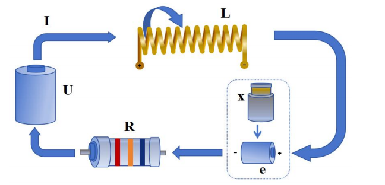

# 音圈电机系统建模

---

## 一、系统物理描述

音圈电机由以下部分构成：



- **电学部分**：线圈电阻 \( R \)、电感 \( L \)，输入电压 \( u(t) \)，电流 \( i(t) \)，反电动势 \( u_e(t) \)。
- **磁路部分**：永磁体提供恒定磁场，通电线圈在磁场中受到电磁力。
- **力学部分**：线圈（动子）质量 \( m \)，机械阻尼 \( b \)，弹簧刚度 \( k \)（若有），输出为位移 \( x(t) \) 或速度 \( v(t) \)。

**假设条件**：

1. 磁场均匀，电磁力常数 \( K_f \) 恒定。
2. 反电动势常数 \( K_e \) 恒定，且满足 \( K_f = K_e \)（能量守恒约束）。
3. 运动方向为直线，忽略摩擦和非线性项。

---

## 二、基本方程建立

设 \( B \) 为磁感应强度，\( l \) 为动子有效长度，\( \theta \) 为动子运动方向与磁场方向的夹角。

### 2.1 电学方程

动子运动时产生反电动势，由假设（2）得：

\[
u_e(t) = B l v \sin\theta = K_e \dot{x}(t)
\]

由基尔霍夫电压定律（KVL），电学回路方程为：

\[
u(t) = L \frac{di(t)}{dt} + R i(t) + K_e \dot{x}(t) \tag{1}
\]

### 2.2 力学方程

由安培力定律，结合假设（1）可得电磁驱动力：

\[
F(t) = B l i(t) \sin\theta = K_f i(t)
\]

由牛顿第二定律，力学平衡方程为：

\[
m \ddot{x}(t) + b \dot{x}(t) + k x(t) = K_f i(t)\tag{2}
\]

### 2.3 耦合方程组

令 \( K_f = K_e = K \)，音圈电机的时域耦合模型可写为：

\[
\boxed{
\begin{cases}
L \dfrac{di}{dt} + R i + K \dot{x} = u(t) \\[6pt]
m \ddot{x} + b \dot{x} + k x = K i(t)
\end{cases}
}
\]

---

## 三、单输入-单输出（SISO）微分方程

输入：电压 $ u(t) $，输出：位移 $ x(t) $

由力学方程解出电流：

\[
i(t) = \frac{m}{K} \ddot{x} + \frac{b}{K} \dot{x} + \frac{k}{K} x
\]

代入电学方程：

\[
u(t) = L \frac{d}{dt} \left( \frac{m}{K} \ddot{x} + \frac{b}{K} \dot{x} + \frac{k}{K} x \right)+ R \left( \frac{m}{K} \ddot{x} + \frac{b}{K} \dot{x} + \frac{k}{K} x \right)+ K \dot{x}
\]

整理后得到**三阶微分方程**：

\[
\boxed{
\frac{L m}{K} x^{(3)}(t)+ \frac{L b + R m}{K} \ddot{x}(t)+ \frac{L k + R b + K^2}{K} \dot{x}(t)+ \frac{R k}{K} x(t)= u(t) \tag{3}
}
\]

---

## 四、工程级联拆解

系统为SISO模型，工程控制中，通常将系统拆分为三个级联通道，以便分层设计控制器。
[控制器设计](./pid参数设计.md)

### 4.1 电压 → 电流（电流环）

输入：电压 $ u(t) $，输出：电流 $ i(t) $

由方程（1），忽略反电动势耦合（或将其视为扰动）进行拉氏变换得：

\[
U(s) = L s I(s) + R I(s) = (L s + R) I(s)
\]

\[
G_i(s) = \frac{I(s)}{U(s)} = \frac{1}{L s + R} = \frac{1/R}{s*L/R + 1}
\]

一阶惯性系统,时间常数 \( \tau_i = L / R \)。推荐控制方式：PI控制器。

### 4.2 电流 → 速度（力学通道）

输入：电流 $ i(t) $，输出：速度 $ v(t) $

由力学方程（2）可得：
\[
i(t) = \frac{m}{K}\dot{v} + \frac{b}{K}v + \frac{k}{K}\int v(t)dt
\]

取拉式变换可得：

\[
G_v(s) = \frac{V(s)}{I(s)} = \frac{K s}{m s^2 + b s + k}
\]

为二阶系统，推荐控制器：PID控制器。

当无弹簧（\( k = 0 \)）时：

\[
G_v(s) = \frac{K}{m s + b}
\]

为一阶惯性环节，时间常数 \( \tau_v = m / b \),推荐控制器：PI控制器。

### 4.3 速度 → 位移（运动学通道）

速度到位移为纯积分关系：

\[
\boxed{
G_x(s) = \frac{X(s)}{V(s)} = \frac{1}{s}
}
\]

推荐控制器：PD控制器。


### 4.4 级联传递函数

将三个通道串联，得到完整的电压到位移传递函数：

\[
\boxed{
G(s) = G_i(s) \cdot G_v(s) \cdot G_x(s)
= \frac{1}{L s + R} \cdot \frac{K}{m s + b} \cdot \frac{1}{s}
}
\]

若保留弹簧项，则有：

\[
G(s) = \frac{K}{s (L s + R)(m s + b) + k (L s + R)}
\]

---

## 五、状态空间模型（现代控制）

### 5.1 状态变量选取

选择物理意义明确的状态变量：

\[
x_1(t) = x(t) \quad \text{（位移）}, \qquad
x_2(t) = \dot{x}(t) \quad \text{（速度）}, \qquad
x_3(t) = i(t) \quad \text{（电流）}
\]

### 5.2 状态方程

由耦合方程组改写为一阶微分方程组：

\[
\begin{cases}
\dot{x}_1 = x_2 \\[4pt]
\dot{x}_2 = \dfrac{K}{m} x_3 - \dfrac{b}{m} x_2 - \dfrac{k}{m} x_1 \\[4pt]
\dot{x}_3 = -\dfrac{R}{L} x_3 - \dfrac{K}{L} x_2 + \dfrac{1}{L} u
\end{cases}
\]

写成标准矩阵形式：

\[
\boxed{
\dot{\mathbf{x}} = A \mathbf{x} + B u(t)
}
\]

其中：

\[
A = \begin{bmatrix}
0 & 1 & 0 \\[4pt]
-\dfrac{k}{m} & -\dfrac{b}{m} & \dfrac{K}{m} \\[4pt]
0 & -\dfrac{K}{L} & -\dfrac{R}{L}
\end{bmatrix},
\qquad
B = \begin{bmatrix} 0 \\[4pt] 0 \\[4pt] \dfrac{1}{L} \end{bmatrix}
\]

### 5.3 输出方程

\[
y(t) = \begin{bmatrix} 1 & 0 & 0 \end{bmatrix} \mathbf{x}(t)
\]

若同时输出速度与电流（用于多环反馈）：

\[
y(t) = \begin{bmatrix}
0 & 1 & 0 \\
0 & 0 & 1
\end{bmatrix} \mathbf{x}(t)
\]

状态空间模型适用于现代控制理论方法，如 LQR、MPC、状态观测器设计等。

---

## 六. 经典多环控制架构

音圈电机采用**三环级联控制**结构，每环独立设计控制器：

```text
┌─────────────────────────────────────────────────────────────────────────────────────┐
│                              三环级联控制系统                                       │
│                                                                                     │
│  ┌──────┐    ┌──────────┐    ┌──────┐    ┌──────────┐    ┌──────┐    ┌──────────┐ │
│  │      │    │  位置环   │    │      │    │  速度环   │    │      │    │  电流环   │ │
│  │ x_ref├───→│  (P/PI)  ├───→│ e_v  ├───→│  (PI)    ├───→│ e_i  ├───→│  (PI)    │ │
│  │      │    │          │    │      │    │          │    │      │    │          │ │
│  └──────┘    └──────────┘    └──────┘    └──────────┘    └──────┘    └──────────┘ │
│       ↑                          ↑                          ↑                       │
│       │                          │                          │                       │
│       │                     ┌────┴────┐                ┌────┴────┐                 │
│       │                     │  v(t)   │                │  i(t)   │                 │
│       │                     │ 速度反馈 │                │ 电流反馈 │                 │
│       │                     └─────────┘                └─────────┘                 │
│       │                                                                             │
│       └────────────────────────── x(t) 位移反馈 ────────────────────────────────────┘
│                                                                                     │
└─────────────────────────────────────────────────────────────────────────────────────┘
```

### 6.1 各环功能与带宽

| 控制环 | 被控对象 | 传递函数 | 典型带宽 | 主要作用 |
|--------|----------|----------|----------|----------|
| 电流环（内环） | 电学子系统 | \( 1/(Ls+R) \) | kHz 级 | 快速跟踪电流指令，抑制电源波动 |
| 速度环（中环） | 力学子系统 | \( K/(ms+b) \) | 数百 Hz | 抑制负载扰动，保证速度平稳 |
| 位置环（外环） | 积分环节 | \( 1/s \) | 数十 Hz | 保证最终定位精度与无静差跟踪 |

### 6.2 多环设计的优势

- **带宽逐级递减**：内环最快，外环最慢，避免振荡耦合。
- **抗干扰能力分层**：电流环抑制电气干扰，速度环抑制机械扰动，位置环保证静态精度。
- **饱和保护**：每环可独立限幅，防止电流过大烧毁线圈。
- **调试便利**：先整定内环，再依次整定外环，参数物理意义明确。

---

## 八、模型参数物理意义汇总

| 符号 | 含义 | 单位 |
|------|------|------|
| \( R \) | 线圈电阻 | \( \Omega \) |
| \( L \) | 线圈电感 | H |
| \( K \) | 力常数 / 反电动势常数 | N/A 或 V·s/m |
| \( m \) | 动子质量 | kg |
| \( b \) | 机械阻尼系数 | N·s/m |
| \( k \) | 弹簧刚度 | N/m |
| \( u(t) \) | 输入电压 | V |
| \( x(t) \) | 输出位移 | m |
| \( i(t) \) | 线圈电流 | A |
| \( v(t) \) | 运动速度 | m/s |

---

## 九、已完成与待拓展内容

### ✅ 已完成

- 时域耦合微分方程
- 单变量高阶微分方程（SISO）
- 三通道级联传递函数（电流环 → 速度环 → 位置环）
- 完整传递函数（全阶 + 简化二阶）
- 状态空间模型（三阶）
- 多环控制架构说明

### 🔜 下一步可继续拓展

1. 加入摩擦非线性（Stribeck 效应）或磁滞饱和效应
2. 电流环 + 速度环 + 位置环的 PI/PID 参数整定公式
3. 频率响应分析与 Bode 图绘制
4. Simulink/Matlab 时域仿真模型搭建
5. 离散化与数字控制器实现（ZOH、Tustin 变换）